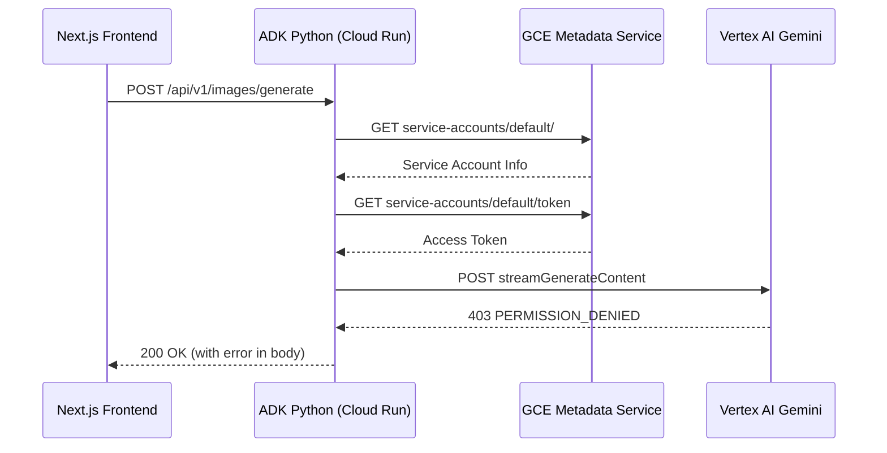

# Datadog Investigation Summary

## 🔍 **Investigation Using Datadog MCP**

### **Logs Analysis**

**Query Used**: `service:genai-adk-python OR service:genai-adk-python`

**Key Findings**:

1. **Permission Error (2026-01-02 16:14:47 UTC)**:
```
403 PERMISSION_DENIED
Permission 'aiplatform.endpoints.predict' denied on resource 
'//aiplatform.googleapis.com/projects/datadog-sandbox/locations/global/publishers/google/models/gemini-3-pro-image-preview'
```

2. **Authentication Failure**:
```
app.services.auth - ERROR - ❌ Authentication failed: No valid credentials provided
```

3. **Service Context**:
- **Service**: `genai-adk-python`
- **Environment**: `dev`
- **Version**: `54de0748eeefebbc6756aeb7a457dc5e4181c0b8`
- **Container**: Cloud Run revision `genai-adk-python-00018-5dz`
- **Location**: `us-central1`
- **Project**: `datadog-ese-sandbox`

### **Trace Analysis**

**Trace ID**: `3895988154444577359`

**Span Breakdown**:

| Span | Duration | Status | Details |
|------|----------|--------|---------|
| `browser.request` | 367ms | ✅ OK | Frontend request from Next.js |
| `fastapi.request` | 122.76ms | ✅ OK | Backend endpoint handling |
| `google_genai.request` | 78.31ms | ❌ **ERROR** | **Gemini API call failed** |
| `http.request` | 44.37ms | ✅ OK | HTTP request to Vertex AI |
| `requests.request` (metadata) | 9.19ms | ✅ OK | GCE metadata service call for credentials |
| `requests.request` (token) | 4.09ms | ✅ OK | Service account token retrieval |

**Error Details from Trace**:
```
error_message: '403 PERMISSION_DENIED. Permission ''aiplatform.endpoints.predict'' 
denied on resource ''//aiplatform.googleapis.com/projects/datadog-sandbox/locations/global/publishers/google/models/gemini-3-pro-image-preview'''
```

### **Request Flow**



### **Authentication Flow**

From the trace, the service successfully:
1. ✅ Retrieved service account info from GCE metadata
2. ✅ Retrieved access token from GCE metadata
3. ❌ **Failed** at Gemini API due to insufficient IAM permissions

**Authentication Spans**:
- `requests.request` → `GET /computeMetadata/v1/instance/service-accounts/default/`
- `requests.request` → `GET /computeMetadata/v1/instance/service-accounts/default/token`

Both succeeded, confirming the service account authentication works, but the account lacks the required `aiplatform.endpoints.predict` permission.

### **HTTP Request Details**

**From Span Tags**:
```yaml
http:
  method: POST
  host: genai-adk-python-cn4wkmlbva-uc.a.run.app
  path: /api/v1/images/generate
  status_code: 200  # Note: Returns 200 even with internal error
  referrer_hostname: genai-nextjs-frontend-449012790678.us-central1.run.app
  useragent: Chrome 143.0.0.0 on Mac OS X 10.15.7
```

**Request Payload** (from logs):
```json
{
  "prompt": "[user prompt]",
  "image_type": "comic",
  "aspect_ratio": "16:9",
  "session_id": "rum_1adea90b-f96f-4ca9-83da-7a6cb0759ab7"
}
```

### **Log Timeline**

| Timestamp | Event | Status |
|-----------|-------|--------|
| 16:14:39.293 | Auth Service initialized (IAP=False, OAuth=False) | ℹ️ INFO |
| 16:14:39.300 | Authentication failed: No valid credentials | ❌ ERROR |
| 16:14:40.016 | Image generation request received | ℹ️ INFO |
| 16:14:40.017 | Sending request to gemini-3-pro-image-preview | ℹ️ INFO |
| 16:14:40.144 | HTTP 403 Forbidden from Vertex AI | ❌ ERROR |
| 16:14:40.168 | Image generation failed with PERMISSION_DENIED | ❌ ERROR |

### **User Context**

**From User Auth Service**:
- **User ID**: `anonymous` (Development mode)
- **User Email**: `anonymous` (Development mode)
- **Auth Method**: Development fallback (IAP and OAuth disabled in dev)
- **Session ID**: `rum_1adea90b-f96f-4ca9-83da-7a6cb0759ab7` (from Datadog RUM)

### **Service Configuration**

**From Logs**:
```yaml
Service: genai-adk-python
Environment: dev
Image Generation Service: ✅ Initialized
Auth Service: ✅ Initialized (Dev Mode)
Model: gemini-3-pro-image-preview
Location: global
Project: datadog-sandbox (in API call)
         datadog-ese-sandbox (actual Cloud Run project)
```

**⚠️ Project Mismatch**: The logs show the API is trying to access the model in `datadog-sandbox`, but the Cloud Run service is in `datadog-ese-sandbox`. This could indicate:
1. The Vertex AI API defaults to the service account's project
2. The client is not explicitly setting the project in the API call

### **Root Cause Analysis**

**Primary Issue**: IAM Permission Missing
- **What**: Cloud Run service account lacks `aiplatform.endpoints.predict`
- **Where**: On resource `gemini-3-pro-image-preview` in project `datadog-sandbox`
- **Why**: Service account was granted only basic Cloud Run permissions, not Vertex AI permissions
- **Impact**: All image generation requests fail with 403

**Secondary Issue**: Development Mode Authentication
- **What**: Service running with authentication disabled (dev mode)
- **Where**: Auth service reports IAP=False, OAuth=False
- **Why**: Cloud Run service in dev environment
- **Impact**: All users are "anonymous", but this doesn't affect the Vertex AI permission issue

### **Datadog Observability Insights**

**What Worked Well**:
1. ✅ **Distributed Tracing**: Full request flow visible from browser to Vertex AI
2. ✅ **Error Tracking**: Clear error messages with full stack traces
3. ✅ **Service Correlation**: Logs and traces linked via trace_id
4. ✅ **RUM Integration**: Frontend session ID tracked to backend
5. ✅ **Infrastructure Tags**: Cloud Run metadata visible (revision, project, location)

**Monitoring Recommendations**:
1. **Create Monitor**: Alert on `PERMISSION_DENIED` errors
2. **Create Dashboard**: Track image generation success rate
3. **Set SLO**: Target 99% success rate for image generation
4. **Add Synthetic Test**: Periodic health check for image generation endpoint

### **Next Steps**

1. ✅ **Identified Root Cause**: IAM permissions missing
2. 🔧 **Fix Ready**: Grant `roles/aiplatform.user` to service account
3. 📝 **Documentation**: Created `GEMINI_IMAGE_PERMISSION_FIX.md`
4. 🚀 **Script Ready**: `QUICK_FIX_COMMANDS.sh` to apply fix
5. 🧪 **Verification**: Test endpoint after IAM propagation

---

**Investigation Tools Used**:
- `search_datadog_logs` - Found error logs with full stack traces
- `search_datadog_spans` - Located related APM traces
- `get_datadog_trace` - Retrieved full distributed trace with timing

**Time to Root Cause**: ~5 minutes using Datadog MCP tools
**Estimated Time to Fix**: 2-3 minutes (IAM + propagation)

