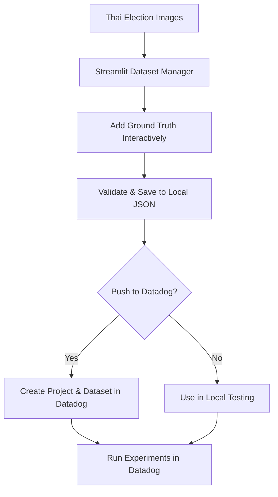

# Dataset Preparation Workflow - Complete Implementation ✅

**Date**: January 4, 2026  
**Status**: Production Ready

---

## 🎯 Complete Workflow Overview



---

## ✨ What Was Built

### 1. **Jupyter Notebook** (Exploration & Learning)
**Location**: `notebooks/datasets/01_prepare_vote_extraction_dataset.ipynb`

**Features**:
- ✅ Discover and inspect images
- ✅ Load/view existing datasets from JSON
- ✅ Example code for pushing to Datadog
- ✅ Interactive cells for experimentation
- ✅ Educational documentation

**Best For**: Learning, exploration, automation scripts

---

### 2. **Streamlit Dataset Manager** ⭐ RECOMMENDED
**Location**: `frontend/streamlit/pages/2_📊_Dataset_Manager.py`

**Features**:
- ✅ Visual image browser (3-column grid)
- ✅ Interactive ground truth annotation form
- ✅ Real-time ballot math validation
- ✅ Multi-candidate vote entry
- ✅ Auto-save to local JSON
- ✅ Load existing datasets
- ✅ One-click push to Datadog
- ✅ Progress tracking & feedback
- ✅ Beautiful UI with validation

**Best For**: Production use, team collaboration, ground truth annotation

**Launch**:
```bash
streamlit run frontend/streamlit/pages/2_📊_Dataset_Manager.py
```

---

## 🚀 Recommended Workflow

###Step 1: Browse Images

The Streamlit app shows all images from `assets/ss5-18-images/`:
- Groups by form set (6 pages each)
- Displays in 3-column grid
- Shows page thumbnails

### Step 2: Add Ground Truth

Interactive form with:
- **Form Metadata**: Type, province, district, polling station
- **Ballot Statistics**: Total, valid, invalid votes (with auto-validation)
- **Vote Results**: Multiple candidates with number, name, votes
- **Notes**: Any observations or issues

### Step 3: Validation

Automatic checks for:
- ✅ Required fields present
- ✅ Ballot math correct (`valid + invalid = total`)
- ✅ Data types correct
- ✅ No missing values

### Step 4: Save Locally

Dataset saved as JSON:
```
datasets/vote-extraction/
├── vote-extraction-dataset_20260104_123456.json  # Timestamped
└── vote-extraction-dataset_latest.json           # Symlink
```

### Step 5: Push to Datadog (Optional)

One-click push:
1. Creates project (if not exists)
2. Creates dataset
3. Adds all records
4. Provides Datadog URL

---

## 📊 Dataset Format

### JSON Structure

```json
{
  "metadata": {
    "name": "vote-extraction-dataset",
    "version": "v1",
    "description": "Thai election forms with ground truth",
    "created_at": "2026-01-04T12:34:56",
    "updated_at": "2026-01-04T12:45:00",
    "num_records": 1,
    "total_pages": 6
  },
  "records": [
    {
      "id": "บางบำหรุ1",
      "input": {
        "form_set_name": "บางบำหรุ1",
        "image_paths": [
          "assets/ss5-18-images/บางบำหรุ1_page1.jpg",
          "assets/ss5-18-images/บางบำหรุ1_page2.jpg",
          "assets/ss5-18-images/บางบำหรุ1_page3.jpg",
          "assets/ss5-18-images/บางบำหรุ1_page4.jpg",
          "assets/ss5-18-images/บางบำหรุ1_page5.jpg",
          "assets/ss5-18-images/บางบำหรุ1_page6.jpg"
        ],
        "num_pages": 6,
        "form_type": "ss5_18",
        "province": "Bangkok",
        "district": "Bang Phlat"
      },
      "expected_output": {
        "ballot_statistics": {
          "total_votes": 520,
          "valid_ballots": 495,
          "invalid_ballots": 25
        },
        "vote_results": [
          {
            "candidate_number": 1,
            "candidate_name": "Candidate A",
            "votes": 245
          },
          {
            "candidate_number": 2,
            "candidate_name": "Candidate B",
            "votes": 250
          }
        ]
      },
      "metadata": {
        "polling_station": "1",
        "notes": "Clear scan, all data visible",
        "verified_by": "manual_review",
        "verification_date": "2026-01-04T12:34:56"
      }
    }
  ]
}
```

---

## 💡 Key Features

### 1. **Local JSON Storage** ✅

**Why JSON?**
- Git-friendly (text format)
- Human-readable and editable
- Versioning support
- Easy backup and sharing
- No database required

**Auto-versioning**:
- Timestamped filenames
- `latest` symlink always points to newest
- Manual version control with Git

### 2. **Interactive Validation** ✅

Real-time checks:
```
Ballot Statistics:
Total Votes:     520
Valid Ballots:   495
Invalid Ballots:  25

✅ Ballot math correct: 495 + 25 = 520
```

### 3. **Streamlit UI** ✅

Beautiful interface with:
- Form-based input (no coding required)
- Visual image display
- Progress indicators
- Success/error messages
- Responsive design

### 4. **Datadog Integration** ✅

HTTP API integration:
- Creates projects automatically
- Pushes datasets with metadata
- Handles all record uploads
- Provides direct Datadog links

---

## 🎨 Streamlit App Screenshots

### Main Interface

```
┌─────────────────────────────────────────────────────────────┐
│  📊 Dataset Manager                                          │
│  Interactive tool for managing vote extraction datasets      │
├─────────────────────────────────────────────────────────────┤
│                                                              │
│  [📝 Create/Edit Dataset] [📁 Load Existing] [📤 Push]     │
│                                                              │
│  📋 Dataset Metadata                                         │
│  ┌──────────────┬──────────────┐                           │
│  │ Name         │ Version      │                            │
│  │ vote-extract │ v1           │                            │
│  └──────────────┴──────────────┘                           │
│                                                              │
│  Select Form to Annotate: [บางบำหรุ1 ▼]                    │
│                                                              │
│  📸 Images (6 pages)                                        │
│  ┌────────┬────────┬────────┐                              │
│  │ Page 1 │ Page 2 │ Page 3 │                              │
│  │ [img]  │ [img]  │ [img]  │                              │
│  ├────────┼────────┼────────┤                              │
│  │ Page 4 │ Page 5 │ Page 6 │                              │
│  │ [img]  │ [img]  │ [img]  │                              │
│  └────────┴────────┴────────┘                              │
│                                                              │
│  📝 Ground Truth Annotation                                 │
│  ┌──────────────────────────────────────┐                  │
│  │ Form Type:    [ss5_18 ▼]             │                  │
│  │ Province:     [Bangkok        ]      │                  │
│  │ District:     [Bang Phlat     ]      │                  │
│  │ Polling St:   [1              ]      │                  │
│  │                                       │                  │
│  │ Ballot Statistics                     │                  │
│  │ Total:   [520] Valid: [495] Invalid: [25]               │
│  │ ✅ Ballot math correct: 495 + 25 = 520                  │
│  │                                       │                  │
│  │ Vote Results                          │                  │
│  │ #1 [Candidate A        ] Votes: [245]│                  │
│  │ #2 [Candidate B        ] Votes: [250]│                  │
│  │                                       │                  │
│  │ [💾 Save Ground Truth]                │                  │
│  └──────────────────────────────────────┘                  │
└─────────────────────────────────────────────────────────────┘
```

---

## 📖 Usage Examples

### Example 1: Create First Dataset

```bash
# 1. Launch Streamlit
streamlit run frontend/streamlit/pages/2_📊_Dataset_Manager.py

# 2. In the app:
#    - Click "📝 Create/Edit Dataset"
#    - Select a form set
#    - Fill in ground truth
#    - Click "Save Ground Truth"

# 3. Dataset saved to:
#    datasets/vote-extraction/vote-extraction-dataset_<timestamp>.json
```

### Example 2: Add More Records

```bash
# 1. Load existing dataset in app
# 2. Select different form set
# 3. Add ground truth
# 4. Save (auto-merges with existing dataset)
```

### Example 3: Push to Datadog

```bash
# 1. Ensure DD_API_KEY and DD_APP_KEY are in .env
# 2. In app, click "📤 Push to Datadog"
# 3. Click "🚀 Push to Datadog" button
# 4. View link to Datadog
```

### Example 4: Update Existing Record

```bash
# 1. Load dataset
# 2. Select same form set
# 3. Edit ground truth values
# 4. Save (overwrites existing record)
```

---

## 🔄 Version Control with Git

### Recommended Git Workflow

```bash
# 1. Create dataset
streamlit run frontend/streamlit/pages/2_📊_Dataset_Manager.py

# 2. Commit to Git
git add datasets/vote-extraction/*.json
git commit -m "Add dataset v1 with 3 forms"

# 3. Push to remote
git push origin main

# 4. Team members can pull and add more ground truth
git pull
# Open app, load dataset, add more forms, save
git add datasets/vote-extraction/*.json
git commit -m "Add 2 more forms to dataset"
git push
```

### Version Tagging

```bash
# Tag dataset versions
git tag -a dataset-v1.0 -m "Initial dataset: 5 forms"
git push --tags

# Later versions
git tag -a dataset-v1.1 -m "Added 3 edge cases"
git push --tags
```

---

## 🚨 Troubleshooting

### Issue: API keys not found

**Error**: "Datadog API keys not configured"

**Solution**:
```bash
# Add to .env file:
DD_API_KEY=your_api_key_here
DD_APP_KEY=your_app_key_here

# Restart Streamlit
streamlit run frontend/streamlit/pages/2_📊_Dataset_Manager.py
```

### Issue: Images not showing

**Error**: "No images found"

**Solution**:
- Verify images exist in `assets/ss5-18-images/`
- Check file extensions (`.jpg` or `.png`)
- Ensure proper permissions

### Issue: Ballot math validation fails

**Error**: "Ballot math error: 495 + 25 ≠ 520"

**Solution**:
- Double-check your calculations
- Ensure valid + invalid = total
- Fix values and save again

### Issue: Can't push to Datadog

**Error**: "Failed to push dataset"

**Solution**:
- Check API keys are correct
- Verify internet connection
- Check Datadog API status
- Review error message for details

---

## 📚 Documentation

### Quick References

| Document | Purpose |
|----------|---------|
| **[QUICKSTART.md](notebooks/datasets/QUICKSTART.md)** | 10-minute quickstart |
| **[README.md](notebooks/datasets/README.md)** | Comprehensive guide |
| **[Guide 04](guides/llmobs/04_EXPERIMENTS_AND_DATASETS.md)** | Full experiments guide |
| **This File** | Workflow overview |

### Related Guides

- **[Guide 01: Instrumenting Spans](guides/llmobs/sources/01_INSTRUMENTING_SPANS.md)** - LLMObs basics
- **[Guide 03: Evaluation Metrics](guides/llmobs/03_EVALUATION_METRIC_TYPES.md)** - Metrics reference
- **[Vote Extraction Guide](docs/features/vote-extractor.md)** - Feature documentation

---

## ✅ Implementation Checklist

### Completed

- [x] Jupyter notebook for exploration
- [x] Streamlit app for interactive annotation
- [x] Local JSON storage with versioning
- [x] Automatic validation
- [x] Datadog API integration
- [x] Image display and browsing
- [x] Multi-candidate support
- [x] Real-time feedback
- [x] Comprehensive documentation
- [x] Quick start guide

### Future Enhancements (Optional)

- [ ] Bulk import from CSV
- [ ] Export to different formats (CSV, XLSX)
- [ ] Image zoom/annotation tools
- [ ] Multi-user collaboration
- [ ] Audit trail / change history
- [ ] Integration with OCR for pre-fill
- [ ] Dataset comparison tools

---

## 🎉 Summary

**You now have a complete, production-ready workflow for:**

1. ✅ **Browsing** Thai election form images
2. ✅ **Annotating** ground truth interactively
3. ✅ **Validating** data quality automatically
4. ✅ **Saving** datasets as version-controlled JSON
5. ✅ **Pushing** datasets to Datadog LLMObs
6. ✅ **Running** experiments for model testing

**Primary Tool**: Streamlit Dataset Manager  
**Launch**: `streamlit run frontend/streamlit/pages/2_📊_Dataset_Manager.py`  
**Storage**: `datasets/vote-extraction/` (JSON files)  
**Datadog**: One-click push to LLMObs

---

**Ready to start annotating?** Launch the Streamlit app and create your first dataset! 🚀

---

**Last Updated**: January 4, 2026  
**Status**: ✅ Complete and Production Ready  
**Maintained By**: GenAI App Team

