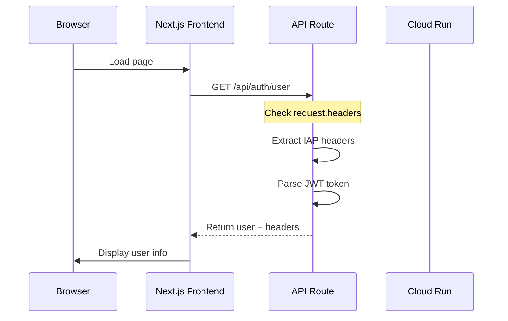

# IAP Integration for Next.js Frontend

## 🔐 **Overview**

This implementation checks for Google Cloud IAP (Identity-Aware Proxy) JWT headers in the Next.js frontend and displays user information.

---

## 📁 **Files Created**

### 1. **`lib/utils/iapAuth.ts`**
Utility functions for parsing IAP JWT tokens and extracting user information.

**Functions**:
- `parseIAPToken(token: string)`: Parses JWT token (base64 decode only, no verification)
- `extractIAPUser(headers: Headers)`: Extracts user info from IAP headers
- `formatUserName(user: IAPUser)`: Formats display name

**Headers Checked**:
- `X-Goog-IAP-JWT-Assertion`: Primary IAP JWT token
- `X-Goog-Authenticated-User-Email`: Alternative IAP header

### 2. **`app/api/auth/user/route.ts`**
Server-side API route that checks IAP headers and returns user information.

**Endpoint**: `GET /api/auth/user`

**Response**:
```json
{
  "user": {
    "email": "user@example.com",
    "userId": "1234567890",
    "name": "John Doe",
    "picture": "https://...",
    "authMethod": "iap"
  },
  "headers": {
    "x-goog-iap-jwt-assertion": "eyJhbGciOiJFUzI1NiIs...",
    "x-goog-authenticated-user-email": "accounts.google.com:user@example.com"
  },
  "timestamp": "2026-01-02T16:00:00.000Z"
}
```

### 3. **`components/auth/UserProfile.tsx`**
React component that displays user information.

**Props**:
- `compact?: boolean` - Show compact view (for header/navbar)
- `showRawData?: boolean` - Show raw JWT payload and headers (debug mode)

**Modes**:
- **Compact**: Shows avatar + name in header
- **Full**: Shows detailed user card with all information

---

## 🎨 **UI Integration**

### **Header** (Compact Mode)
```tsx
<Header title="Dashboard" />
```

Shows user info in the header:
- User avatar (if available)
- User name or email
- Auth method badge (IAP or Dev Mode)

### **Dashboard** (Full Mode)
```tsx
<UserProfile showRawData={true} />
```

Shows detailed user card:
- User avatar
- Full name
- Email address
- User ID
- Authentication method
- IAP headers (if `showRawData={true}`)
- JWT payload (if `showRawData={true}`)
- Refresh button

---

## 🔍 **How It Works**

### **1. Request Flow**



### **2. IAP Headers**

When IAP is enabled, Google Cloud adds these headers:

```http
X-Goog-IAP-JWT-Assertion: eyJhbGciOiJFUzI1NiIs...
X-Goog-Authenticated-User-Email: accounts.google.com:user@example.com
```

**JWT Payload**:
```json
{
  "iss": "https://cloud.google.com/iap",
  "sub": "accounts.google.com:1234567890",
  "email": "user@example.com",
  "name": "John Doe",
  "picture": "https://lh3.googleusercontent.com/...",
  "aud": "/projects/PROJECT_NUMBER/apps/PROJECT_ID",
  "exp": 1704196800,
  "iat": 1704193200
}
```

### **3. Fallback Mode**

If no IAP headers are found (development environment):
```json
{
  "email": "dev@localhost",
  "userId": "dev_user",
  "name": "Development User",
  "authMethod": "development"
}
```

---

## 🧪 **Testing**

### **Local Development** (No IAP)

1. Start the development server:
   ```bash
   npm run dev
   ```

2. Open http://localhost:3000

3. Expected behavior:
   - Shows "Development User"
   - Auth method: "🔧 Dev Mode"
   - User ID: `dev_user`
   - Email: `dev@localhost`

### **Cloud Run with IAP Disabled** (Current State)

1. Access https://genai-nextjs-frontend-449012790678.us-central1.run.app/

2. Expected behavior:
   - Same as local development (no IAP headers)
   - Falls back to development mode

### **Cloud Run with IAP Enabled** (After Setup)

1. Enable IAP (see `IAP_STATUS_REPORT.md`)

2. Access the service URL

3. Expected behavior:
   - Google Sign-In prompt
   - After authentication, shows real user info
   - Auth method: "🔐 IAP Authenticated"
   - Real email and user ID from Google account

---

## 🔧 **Testing the API Route**

### **Check IAP Headers**

```bash
# Local dev (no IAP)
curl http://localhost:3000/api/auth/user | jq

# Cloud Run (no IAP)
curl https://genai-nextjs-frontend-449012790678.us-central1.run.app/api/auth/user | jq
```

**Expected Response** (No IAP):
```json
{
  "user": {
    "email": "dev@localhost",
    "userId": "dev_user",
    "name": "Development User",
    "authMethod": "development"
  },
  "headers": {},
  "timestamp": "2026-01-02T16:00:00.000Z"
}
```

**Expected Response** (With IAP):
```json
{
  "user": {
    "email": "user@example.com",
    "userId": "1234567890",
    "name": "John Doe",
    "authMethod": "iap",
    "raw": {
      "iss": "https://cloud.google.com/iap",
      "sub": "accounts.google.com:1234567890",
      "email": "user@example.com",
      ...
    }
  },
  "headers": {
    "x-goog-iap-jwt-assertion": "eyJhbGciOiJFUzI1NiIs...",
    "x-goog-authenticated-user-email": "accounts.google.com:user@example.com"
  },
  "timestamp": "2026-01-02T16:00:00.000Z"
}
```

---

## 📊 **Monitoring with Datadog**

### **Check Frontend Logs**

```
service:genai-nextjs-frontend "IAP Headers" OR "Extracted User"
```

### **Check API Route Calls**

```
service:genai-nextjs-frontend resource_name:"GET /api/auth/user"
```

### **Track User Sessions**

The Datadog RUM integration already tracks sessions. With IAP, you can correlate:
- RUM session ID
- IAP user email
- Backend user authentication

---

## 🔐 **Security Notes**

### **JWT Verification**

⚠️ **Important**: The current implementation **does NOT verify** the JWT signature.

**For Production**:
1. JWT verification should be done on the backend
2. Frontend only displays the data
3. Never trust JWT data for authorization without verification

**Backend Verification** (already implemented in `services/adk-python/app/services/auth.py`):
```python
from google.oauth2 import id_token
from google.auth.transport import requests

decoded_token = id_token.verify_oauth2_token(
    jwt_token,
    requests.Request(),
    audience=IAP_AUDIENCE
)
```

### **Data Privacy**

- User email and name are visible in the UI
- Use `showRawData={false}` in production to hide JWT payload
- Compact mode in header is safe for production

---

## 🚀 **Deployment**

### **Current Setup** (No Changes Needed)

The code works automatically:
- **Local dev**: Shows "Development User"
- **Cloud Run (no IAP)**: Shows "Development User"
- **Cloud Run (with IAP)**: Shows real user from IAP headers

### **To Enable IAP Display**

No code changes needed! Just:
1. Enable IAP in GCP Console
2. Redeploy services (or existing deployments will pick it up automatically)
3. Access the service → Google Sign-In → User info displayed

---

## 🎯 **Usage Examples**

### **Show User in Any Page**

```tsx
import { UserProfile } from '@/components/auth/UserProfile';

export default function MyPage() {
  return (
    <div>
      <UserProfile showRawData={false} />
    </div>
  );
}
```

### **Get User Data Programmatically**

```tsx
'use client';

import { useEffect, useState } from 'react';

export default function MyComponent() {
  const [user, setUser] = useState(null);

  useEffect(() => {
    fetch('/api/auth/user')
      .then(res => res.json())
      .then(data => setUser(data.user));
  }, []);

  return <div>Welcome, {user?.name || 'Guest'}!</div>;
}
```

---

## 🐛 **Troubleshooting**

### **"Development User" Always Shows**

**Cause**: IAP is not enabled or headers are not being passed.

**Check**:
1. Is IAP enabled in GCP Console?
2. Is `IAP_AUDIENCE` set in environment variables?
3. Check API route logs: `console.log('📊 IAP Headers:', headersList)`

### **"Failed to fetch user" Error**

**Cause**: API route is not accessible.

**Check**:
1. Is the API route deployed? (`/api/auth/user`)
2. Check browser console for fetch errors
3. Check Network tab in DevTools

### **No User Avatar**

**Cause**: Google profile doesn't have a public picture, or IAP token doesn't include `picture` field.

**Solution**: This is normal. UI gracefully handles missing avatars.

---

## 📚 **Related Documentation**

- **IAP Status**: `IAP_STATUS_REPORT.md` - Current IAP configuration
- **Backend Auth**: `services/adk-python/AUTHENTICATION.md` - Backend IAP verification
- **Fix Summary**: `AUTH_FIX_SUMMARY.md` - Recent auth fixes

---

**Status**: ✅ Implemented and ready to use

**Next Steps**: 
1. Test locally (shows "Development User")
2. Deploy to Cloud Run (currently shows "Development User")
3. Enable IAP (will automatically show real user info)

