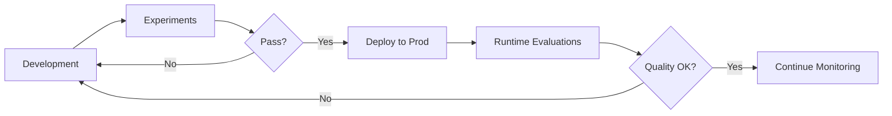
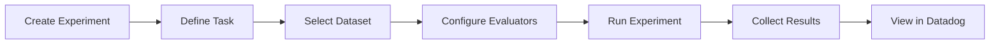
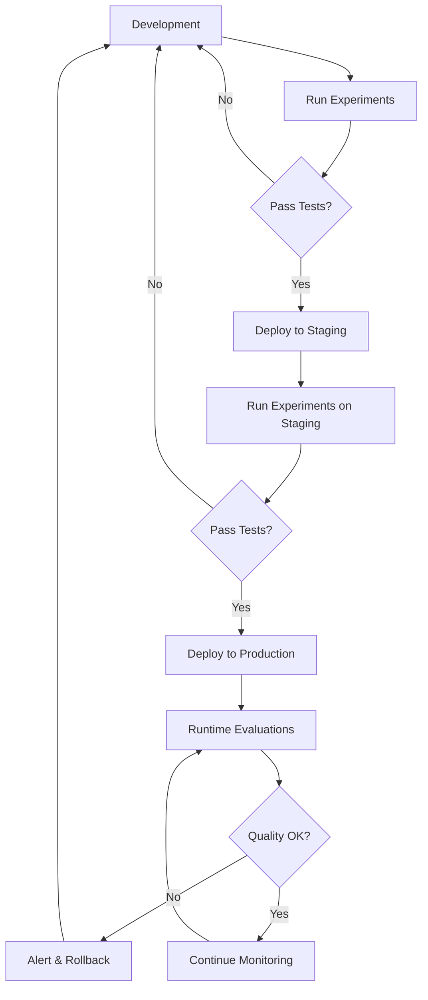

# Guide: Systematic Testing with LLM Experiments & Datasets

**Version**: 1.0  
**Last Updated**: January 4, 2026  
**Audience**: ML Engineers, QA Engineers, DevOps Engineers, Data Scientists  
**Prerequisites**: [Guide 01: Instrumenting Spans](./01_INSTRUMENTING_SPANS.md), [Guide 03: Evaluation Metric Types](./03_EVALUATION_METRIC_TYPES.md)  
**Estimated Reading Time**: 25-30 minutes

---

## Table of Contents

1. [Overview & Concepts](#overview--concepts)
2. [Understanding Projects](#understanding-projects)
3. [Datasets Deep Dive](#datasets-deep-dive)
4. [Running Experiments](#running-experiments)
5. [CI/CD Integration](#cicd-integration)
6. [HTTP API Reference](#http-api-reference)
7. [Implementation Examples](#implementation-examples)
8. [Best Practices](#best-practices)
9. [Experiments vs Runtime Evaluations](#experiments-vs-runtime-evaluations)
10. [Advanced Topics](#advanced-topics)
11. [Troubleshooting](#troubleshooting)
12. [Quick Start Guide](#quick-start-guide)

---

## Overview & Concepts

### What are LLM Experiments?

**LLM Experiments** in Datadog are systematic, **offline testing frameworks** that allow you to validate your LLM application's quality before deploying to production. Unlike runtime evaluations that monitor live production traffic, experiments run against **curated test datasets** in a controlled environment.

Think of experiments as **unit tests for your LLM applications** - they help you:
- ✅ Validate changes before deployment
- ✅ Compare different models or prompts
- ✅ Catch regressions early
- ✅ Track quality trends over time
- ✅ Make data-driven decisions

### Experiments vs Runtime Evaluations

**Key Differences:**

| Aspect | Runtime Evaluations (Guide 03) | Experiments (This Guide) |
|--------|-------------------------------|--------------------------|
| **When** | Production (live traffic) | Pre-deployment (testing) |
| **Data** | Real user requests | Curated test datasets |
| **Purpose** | Monitor quality in real-time | Validate before release |
| **Execution** | Per-request, asynchronous | Batch processing, synchronous |
| **Automation** | Always running | CI/CD triggered |
| **Feedback** | User feedback, production metrics | Automated evaluators, ground truth |
| **Scope** | Individual LLM calls | Full experiment runs (multiple records) |
| **Cost** | Continuous (all traffic) | On-demand (test runs only) |

**They Work Together:**



### Core Components

#### 1. **Projects**
Organizational units that group related experiments and datasets.

**Example**: `vote-extraction-project`, `chatbot-project`, `content-generation-project`

#### 2. **Datasets**
Collections of test cases with inputs and expected outputs.

**Example Dataset Record**:
```json
{
  "input": {
    "image_url": "s3://bucket/election-form-001.jpg",
    "form_type": "bangkok_2024"
  },
  "expected_output": {
    "total_votes": 1250,
    "valid_ballots": 1200,
    "invalid_ballots": 50
  }
}
```

#### 3. **Experiments**
Test runs that execute your LLM task against a dataset and evaluate results.

**Example**: "Test Gemini 2.0 Flash with enhanced prompt v3"

#### 4. **Tasks**
The LLM operation you want to test (e.g., vote extraction, content generation, classification).

```python
def extract_votes(input_data):
    """Task: Extract votes from election form image."""
    response = model.generate_content(
        prompt=build_prompt(input_data),
        image=load_image(input_data["image_url"])
    )
    return parse_response(response)
```

#### 5. **Evaluators**
Functions that score task outputs against expected results.

**Types**:
- **Per-Record Evaluators**: Score each individual output
- **Summary Evaluators**: Aggregate metrics across all records

```python
def accuracy_evaluator(output, expected):
    """Evaluator: Calculate extraction accuracy."""
    correct_fields = sum(
        1 for k, v in expected.items() 
        if output.get(k) == v
    )
    return correct_fields / len(expected)
```

### When to Use Experiments

✅ **Use Experiments For:**
- Pre-deployment validation
- Prompt engineering and optimization
- Model comparison (A/B testing)
- Regression testing
- Performance benchmarking
- Quality assurance
- Tracking improvements over time

❌ **Don't Use Experiments For:**
- Real-time production monitoring (use Runtime Evaluations)
- User feedback collection (use Runtime Evaluations)
- Live A/B testing with users (use Feature Flags + Runtime Evaluations)
- High-frequency testing (cost and rate limits)

### Benefits & Use Cases

#### **1. Catch Regressions Early**
```
✅ PR merged → CI/CD triggers experiment → 95% accuracy (baseline: 98%)
❌ Experiment fails → Alerts team → PR reverted before prod deployment
```

#### **2. Data-Driven Prompt Engineering**
```
Experiment 1: Basic prompt         → 78% accuracy
Experiment 2: Few-shot examples    → 85% accuracy
Experiment 3: Chain-of-thought     → 92% accuracy ✅ Winner!
```

#### **3. Cost-Performance Optimization**
```
Model A: $0.50 per 1K requests, 95% accuracy
Model B: $0.10 per 1K requests, 93% accuracy ✅ Better ROI!
```

#### **4. Quality Trends Over Time**
```
Week 1: 90% accuracy
Week 2: 92% accuracy (after prompt improvement)
Week 3: 88% accuracy ❌ Regression detected!
Week 4: 95% accuracy (after fix)
```

---

## Understanding Projects

### What is a Project?

A **Project** is the top-level organizational unit in Datadog LLM Experiments. It groups related datasets and experiments for a specific application or feature.

**Purpose**:
- Organize experiments by application
- Isolate different features or models
- Enable team-based access control
- Track progress per project

### Creating Projects

#### Via UI (Datadog Web App)

1. Navigate to **LLM Observability → Experiments**
2. Click **"Create Project"**
3. Fill in:
   - **Project Name**: `vote-extraction-project`
   - **Description**: "Testing vote extraction accuracy for Thai elections"
4. Click **"Create"**

#### Via API (Programmatic)

```python
import requests
import os

DATADOG_API_KEY = os.getenv("DD_API_KEY")
DATADOG_APP_KEY = os.getenv("DD_APP_KEY")
DATADOG_SITE = "datadoghq.com"  # or your site

def create_project(name: str, description: str) -> dict:
    """Create a new LLM Observability project."""
    url = f"https://api.{DATADOG_SITE}/api/v2/llm-obs/v1/projects"
    headers = {
        "DD-API-KEY": DATADOG_API_KEY,
        "DD-APPLICATION-KEY": DATADOG_APP_KEY,
        "Content-Type": "application/json",
    }
    payload = {
        "data": {
            "type": "project",
            "attributes": {
                "name": name,
                "description": description,
            }
        }
    }
    
    response = requests.post(url, json=payload, headers=headers)
    response.raise_for_status()
    return response.json()

# Example usage
project = create_project(
    name="vote-extraction-project",
    description="Testing vote extraction accuracy for Thai elections"
)
print(f"Created project: {project['data']['id']}")
```

### Project Organization Strategies

#### **Strategy 1: By Application**
```
Projects:
├── vote-extraction-project
├── chatbot-project
└── content-generation-project
```

**Use When**: You have distinct applications with separate teams.

#### **Strategy 2: By Feature**
```
Projects:
├── vote-extraction-ballot-stats
├── vote-extraction-candidate-info
└── vote-extraction-validation
```

**Use When**: One application has multiple features to test independently.

#### **Strategy 3: By Environment**
```
Projects:
├── vote-extraction-dev
├── vote-extraction-staging
└── vote-extraction-prod-validation
```

**Use When**: You want to isolate testing across environments.

#### **Strategy 4: By Model**
```
Projects:
├── gemini-2-flash-experiments
├── gemini-1-5-pro-experiments
└── claude-3-opus-experiments
```

**Use When**: Comparing different LLM providers or versions.

### Best Practices for Project Structure

✅ **Do:**
- Use clear, descriptive names
- Include project purpose in description
- Keep projects focused (one app or feature)
- Document project ownership
- Archive old projects

❌ **Don't:**
- Create too many granular projects
- Mix unrelated experiments
- Use generic names like "test-project-1"
- Leave projects undocumented

### Example: Organizing by Application Feature

```python
# Create projects for vote extraction features
projects = [
    {
        "name": "vote-extraction-ballot-statistics",
        "description": "Test ballot counting accuracy (total, valid, invalid)"
    },
    {
        "name": "vote-extraction-candidate-results",
        "description": "Test candidate vote extraction accuracy"
    },
    {
        "name": "vote-extraction-form-metadata",
        "description": "Test form info extraction (location, date, form type)"
    },
]

for proj in projects:
    created = create_project(proj["name"], proj["description"])
    print(f"✅ Created: {proj['name']}")
```

---

## Datasets Deep Dive

### 3.1 What are Datasets?

A **Dataset** is a collection of test cases (records) used to evaluate your LLM application. Each record contains:
- **Input**: Data sent to your LLM task
- **Expected Output**: Ground truth for comparison

**Purpose**:
- Provide consistent test cases
- Enable reproducible experiments
- Track quality over time
- Support regression testing

### 3.2 Creating Datasets

#### Dataset Structure

```json
{
  "project_id": "proj-123",
  "name": "thai-election-forms-v1",
  "description": "20 Bangkok election forms with ground truth",
  "records": [
    {
      "input": {
        "image_url": "s3://bucket/form-001.jpg",
        "form_type": "bangkok_2024"
      },
      "expected_output": {
        "total_votes": 1250,
        "valid_ballots": 1200,
        "invalid_ballots": 50,
        "candidates": [
          {"name": "Candidate A", "votes": 650},
          {"name": "Candidate B", "votes": 550}
        ]
      }
    }
  ]
}
```

#### Creating a Dataset via API

```python
def create_dataset(
    project_id: str,
    name: str,
    description: str,
    records: list[dict]
) -> dict:
    """Create a new dataset."""
    url = f"https://api.{DATADOG_SITE}/api/v2/llm-obs/v1/datasets"
    headers = {
        "DD-API-KEY": DATADOG_API_KEY,
        "DD-APPLICATION-KEY": DATADOG_APP_KEY,
        "Content-Type": "application/json",
    }
    payload = {
        "data": {
            "type": "dataset",
            "attributes": {
                "project_id": project_id,
                "name": name,
                "description": description,
            }
        }
    }
    
    response = requests.post(url, json=payload, headers=headers)
    response.raise_for_status()
    dataset = response.json()
    
    # Add records
    dataset_id = dataset["data"]["id"]
    add_dataset_records(dataset_id, records)
    
    return dataset

def add_dataset_records(dataset_id: str, records: list[dict]):
    """Add records to a dataset."""
    url = f"https://api.{DATADOG_SITE}/api/v2/llm-obs/v1/datasets/{dataset_id}/records"
    headers = {
        "DD-API-KEY": DATADOG_API_KEY,
        "DD-APPLICATION-KEY": DATADOG_APP_KEY,
        "Content-Type": "application/json",
    }
    
    for record in records:
        payload = {
            "data": {
                "type": "dataset_record",
                "attributes": {
                    "input": record["input"],
                    "expected_output": record["expected_output"],
                }
            }
        }
        response = requests.post(url, json=payload, headers=headers)
        response.raise_for_status()
    
    print(f"✅ Added {len(records)} records to dataset {dataset_id}")

# Example usage
records = [
    {
        "input": {
            "image_url": "s3://elections/form-001.jpg",
            "form_type": "bangkok_2024"
        },
        "expected_output": {
            "total_votes": 1250,
            "valid_ballots": 1200,
            "invalid_ballots": 50
        }
    },
    # Add more records...
]

dataset = create_dataset(
    project_id="proj-123",
    name="thai-election-forms-v1",
    description="20 Bangkok election forms with ground truth",
    records=records
)
```

### 3.3 Using the Python SDK for Datasets

**Note**: The Datadog LLMObs Python SDK (`ddtrace`) now provides methods for dataset management in **ddtrace >= 3.18.0**. This is a newer feature and may not be fully documented in all Datadog guides.

#### Creating a Dataset with the SDK

```python
from ddtrace.llmobs import LLMObs

# Initialize LLMObs
LLMObs.enable(
    ml_app="vote-extractor",
    api_key=DD_API_KEY,
    site=DD_SITE,
)

# Create a dataset
dataset = LLMObs.create_dataset(
    name="thai-election-forms-v1",
    description="20 Bangkok election forms with ground truth"
)

print(f"✅ Created dataset: {dataset}")
```

#### Loading a Dataset with the SDK

```python
# Load (pull) a dataset from Datadog
dataset = LLMObs.pull_dataset(
    dataset_name="thai-election-forms-v1",
    project_name="vote-extraction-project",
    # version=1  # Optional: specify version, defaults to latest
)

print(f"✅ Loaded dataset with {len(dataset)} records")
```

#### Understanding the Dataset Object

The `Dataset` object returned by `LLMObs.pull_dataset()` is a **list-like wrapper** with the following characteristics:

**✅ Available Attributes/Methods:**
- `len(dataset)` - Number of records in the dataset
- `dataset[i]` - Access individual records by index
- Iteration - `for record in dataset:`

**❌ Limited or Missing Attributes:**
- `current_version` - **Not reliably exposed** in all ddtrace versions
- Version info may be stored internally but not as a public attribute

**Best Practice for Version Tracking:**

```python
# Option 1: Use getattr with default
dataset = LLMObs.pull_dataset(dataset_name="my-dataset", project_name="my-project")
version = getattr(dataset, 'current_version', None)
if version is not None:
    print(f"Dataset version: {version}")
else:
    print("Version info not available (manage versions manually)")

# Option 2: Track versions manually in dataset metadata
dataset_metadata = {
    "name": "thai-election-forms",
    "version": "v1.0",
    "date": "2025-01-01",
    "records_count": len(dataset),
    "description": "Initial dataset with 20 forms"
}
```

**Record Structure:**

Each record in a dataset contains:
```python
{
    "input_data": {
        "form_set_name": "บางบำหรุ 1",
        "image_paths": ["/path/to/page1.jpg", "/path/to/page2.jpg"]
    },
    "expected_output": {
        "form_info": {"province": "กรุงเทพมหานคร", ...},
        "ballot_statistics": {"ballots_used": 1250, ...},
        "vote_results": [...]
    }
}
```

### 3.4 Dataset Versioning

**Why Version Datasets?**
- Track changes to test cases
- Compare results across versions
- Rollback to previous versions
- Maintain historical records

**When to Create a New Version:**
- ✅ Adding new test cases
- ✅ Fixing ground truth errors
- ✅ Updating expected outputs
- ✅ Significant dataset changes

**When to Update Existing Version:**
- ✅ Minor corrections
- ✅ Metadata updates
- ✅ Non-breaking changes

#### Creating a New Dataset Version

```python
def create_dataset_version(
    dataset_id: str,
    version_number: int,
    changes_description: str
) -> dict:
    """Create a new version of an existing dataset."""
    url = f"https://api.{DATADOG_SITE}/api/v2/llm-obs/v1/datasets"
    headers = {
        "DD-API-KEY": DATADOG_API_KEY,
        "DD-APPLICATION-KEY": DATADOG_APP_KEY,
        "Content-Type": "application/json",
    }
    payload = {
        "data": {
            "type": "dataset",
            "attributes": {
                "project_id": get_dataset_project(dataset_id),
                "name": get_dataset_name(dataset_id),
                "description": f"v{version_number}: {changes_description}",
                "dataset_version": version_number,
            }
        }
    }
    
    response = requests.post(url, json=payload, headers=headers)
    response.raise_for_status()
    return response.json()

# Example: Create v2 with additional test cases
dataset_v2 = create_dataset_version(
    dataset_id="ds-123",
    version_number=2,
    changes_description="Added 10 edge cases for invalid ballot detection"
)
```

### 3.4 Managing Dataset Records

#### Adding Records

```python
def add_single_record(
    dataset_id: str,
    input_data: dict,
    expected_output: dict
):
    """Add a single record to a dataset."""
    url = f"https://api.{DATADOG_SITE}/api/v2/llm-obs/v1/datasets/{dataset_id}/records"
    headers = {
        "DD-API-KEY": DATADOG_API_KEY,
        "DD-APPLICATION-KEY": DATADOG_APP_KEY,
        "Content-Type": "application/json",
    }
    payload = {
        "data": {
            "type": "dataset_record",
            "attributes": {
                "input": input_data,
                "expected_output": expected_output,
            }
        }
    }
    
    response = requests.post(url, json=payload, headers=headers)
    response.raise_for_status()
    return response.json()
```

#### Bulk Adding Records

```python
def bulk_add_records(dataset_id: str, records: list[dict]):
    """Efficiently add multiple records."""
    for i, record in enumerate(records):
        try:
            add_single_record(
                dataset_id,
                record["input"],
                record["expected_output"]
            )
            print(f"✅ Added record {i+1}/{len(records)}")
        except Exception as e:
            print(f"❌ Failed to add record {i+1}: {e}")
```

#### Updating Records

```python
def update_record(
    dataset_id: str,
    record_id: str,
    new_expected_output: dict
):
    """Update a dataset record's expected output."""
    url = f"https://api.{DATADOG_SITE}/api/v2/llm-obs/v1/datasets/{dataset_id}/records/{record_id}"
    headers = {
        "DD-API-KEY": DATADOG_API_KEY,
        "DD-APPLICATION-KEY": DATADOG_APP_KEY,
        "Content-Type": "application/json",
    }
    payload = {
        "data": {
            "type": "dataset_record",
            "attributes": {
                "expected_output": new_expected_output,
            }
        }
    }
    
    response = requests.patch(url, json=payload, headers=headers)
    response.raise_for_status()
    return response.json()
```

#### Deleting Records

```python
def delete_record(dataset_id: str, record_id: str):
    """Delete a specific record from a dataset."""
    url = f"https://api.{DATADOG_SITE}/api/v2/llm-obs/v1/datasets/{dataset_id}/records/{record_id}"
    headers = {
        "DD-API-KEY": DATADOG_API_KEY,
        "DD-APPLICATION-KEY": DATADOG_APP_KEY,
    }
    
    response = requests.delete(url, headers=headers)
    response.raise_for_status()
    print(f"✅ Deleted record {record_id}")
```

### 3.5 Dataset Design Best Practices

#### **1. Representative Test Cases**

✅ **Good Dataset:**
```python
records = [
    # Typical cases (60%)
    {"input": {"form": "standard_bangkok_2024.jpg"}, ...},
    {"input": {"form": "standard_chiangmai_2024.jpg"}, ...},
    
    # Edge cases (30%)
    {"input": {"form": "damaged_form.jpg"}, ...},
    {"input": {"form": "low_quality_scan.jpg"}, ...},
    {"input": {"form": "handwritten_corrections.jpg"}, ...},
    
    # Error cases (10%)
    {"input": {"form": "blank_form.jpg"}, ...},
    {"input": {"form": "non_election_document.jpg"}, ...},
]
```

#### **2. Data Quality and Diversity**

**Checklist:**
- ✅ **Variety**: Different provinces, years, form types
- ✅ **Quality Levels**: High-res, low-res, damaged, clear
- ✅ **Edge Cases**: Unusual but valid scenarios
- ✅ **Error Cases**: Invalid inputs, missing data
- ✅ **Ground Truth**: Verified by humans, double-checked
- ✅ **Balance**: Representative distribution of categories

#### **3. Size Considerations**

| Dataset Size | Use Case | Typical Duration |
|--------------|----------|------------------|
| **5-10 records** | Smoke tests, quick validation | < 1 minute |
| **20-50 records** | Development, iteration | 2-5 minutes |
| **100-200 records** | Pre-deployment validation | 10-20 minutes |
| **500+ records** | Comprehensive benchmarking | 30+ minutes |

**Recommendation**: Start with 20-50 high-quality records, expand as needed.

#### **4. Privacy Considerations**

⚠️ **If using real data:**
- Remove or anonymize PII
- Use synthetic data for sensitive fields
- Comply with data protection regulations
- Document data sources and consent

✅ **Better Approach:**
```python
# Anonymize sensitive data in test datasets
def anonymize_record(record: dict) -> dict:
    """Remove PII from dataset records."""
    record["input"]["voter_id"] = "VOTER_" + hash_id(record["input"]["voter_id"])
    record["input"]["location"] = "Test Location"
    return record
```

#### **5. Version Control for Datasets**

```python
# Track dataset versions like code
DATASET_VERSIONS = {
    "v1.0": {
        "date": "2024-01-15",
        "records": 20,
        "description": "Initial dataset with Bangkok forms"
    },
    "v1.1": {
        "date": "2024-02-01",
        "records": 30,
        "description": "Added Chiang Mai forms"
    },
    "v2.0": {
        "date": "2024-03-15",
        "records": 50,
        "description": "Major update: added edge cases and error scenarios"
    }
}
```

---

## Running Experiments

### 4.1 Experiment Basics

An **Experiment** is a test run that:
1. Executes your **task** against every record in a **dataset**
2. Collects outputs
3. Runs **evaluators** to score outputs
4. Aggregates results with **summary evaluators**
5. Displays results in Datadog UI

**Experiment Lifecycle:**



### 4.2 Tasks

A **Task** is the LLM operation you want to test. It takes an input from the dataset and produces an output.

#### Task Implementation Pattern

```python
from typing import Any, Dict

def vote_extraction_task(input_data: Dict[str, Any]) -> Dict[str, Any]:
    """
    Task: Extract vote data from election form image.
    
    Args:
        input_data: Dataset record input
            {
                "image_url": "s3://bucket/form-001.jpg",
                "form_type": "bangkok_2024"
            }
    
    Returns:
        Extracted vote data
            {
                "total_votes": 1250,
                "valid_ballots": 1200,
                "invalid_ballots": 50,
                "candidates": [...]
            }
    """
    try:
        # Load image
        image_data = load_image_from_s3(input_data["image_url"])
        
        # Build prompt
        prompt = build_extraction_prompt(input_data["form_type"])
        
        # Call LLM
        response = model.generate_content(
            prompt=prompt,
            image=image_data,
            temperature=0.0,  # Deterministic for testing
        )
        
        # Parse response
        result = parse_extraction_response(response.text)
        
        return result
        
    except Exception as e:
        # Return error info for evaluators to handle
        return {
            "error": str(e),
            "error_type": type(e).__name__,
        }
```

#### Task Best Practices

✅ **Do:**
- Keep tasks deterministic (temperature=0.0)
- Handle errors gracefully
- Return structured outputs
- Log important info for debugging
- Include timestamps and metadata

❌ **Don't:**
- Use random sampling
- Ignore errors
- Return unstructured text
- Make external API calls without timeouts
- Modify shared state

### 4.3 Evaluators

**Evaluators** score task outputs against expected outputs.

#### Per-Record Evaluator

Scores each individual output:

```python
def accuracy_evaluator(
    output: Dict[str, Any],
    expected: Dict[str, Any]
) -> Dict[str, Any]:
    """
    Evaluate extraction accuracy.
    
    Returns metric for this single record.
    """
    # Check for errors
    if "error" in output:
        return {
            "metric_type": "categorical",
            "label": "extraction_status",
            "categorical_value": "failed",
            "metadata": {"error": output["error"]}
        }
    
    # Calculate field accuracy
    total_fields = len(expected)
    correct_fields = sum(
        1 for key, expected_val in expected.items()
        if output.get(key) == expected_val
    )
    accuracy = correct_fields / total_fields if total_fields > 0 else 0.0
    
    return {
        "metric_type": "score",
        "label": "field_accuracy",
        "score_value": accuracy,
        "metadata": {
            "correct_fields": correct_fields,
            "total_fields": total_fields,
        }
    }
```

#### Summary Evaluator

Aggregates metrics across all records:

```python
def summary_evaluator(all_results: list[Dict[str, Any]]) -> Dict[str, Any]:
    """
    Calculate aggregate metrics across all experiment results.
    
    Args:
        all_results: List of (output, expected, metrics) tuples
    
    Returns:
        Summary metrics for the entire experiment
    """
    # Extract accuracies
    accuracies = [
        metric["score_value"]
        for result in all_results
        for metric in result.get("metrics", [])
        if metric["label"] == "field_accuracy"
    ]
    
    # Calculate statistics
    avg_accuracy = sum(accuracies) / len(accuracies) if accuracies else 0.0
    min_accuracy = min(accuracies) if accuracies else 0.0
    max_accuracy = max(accuracies) if accuracies else 0.0
    
    # Count failures
    failures = sum(
        1 for result in all_results
        if any(
            m.get("categorical_value") == "failed"
            for m in result.get("metrics", [])
        )
    )
    
    return {
        "avg_accuracy": avg_accuracy,
        "min_accuracy": min_accuracy,
        "max_accuracy": max_accuracy,
        "total_records": len(all_results),
        "failed_records": failures,
        "success_rate": (len(all_results) - failures) / len(all_results),
    }
```

#### Evaluator Types

| Evaluator Type | Metric Type | Example Use Case |
|----------------|-------------|------------------|
| **Exact Match** | `categorical` | Pass/fail for exact output match |
| **Field Accuracy** | `score` | Percentage of correct fields |
| **Semantic Similarity** | `score` | Text similarity (0-1) |
| **Format Validation** | `categorical` | Valid JSON, valid schema |
| **Performance** | `score` | Latency, token count, cost |
| **Business Logic** | `categorical` | Custom business rules |

### 4.4 Creating & Running Experiments

#### Manual Experiment Creation (API)

```python
import time
from typing import List, Dict, Any

def create_experiment(
    project_id: str,
    dataset_id: str,
    name: str,
    description: str,
    config: Dict[str, Any] = None
) -> dict:
    """Create a new experiment."""
    url = f"https://api.{DATADOG_SITE}/api/v2/llm-obs/v1/experiments"
    headers = {
        "DD-API-KEY": DATADOG_API_KEY,
        "DD-APPLICATION-KEY": DATADOG_APP_KEY,
        "Content-Type": "application/json",
    }
    payload = {
        "data": {
            "type": "experiment",
            "attributes": {
                "project_id": project_id,
                "dataset_id": dataset_id,
                "name": name,
                "description": description,
                "config": config or {},
            }
        }
    }
    
    response = requests.post(url, json=payload, headers=headers)
    response.raise_for_status()
    return response.json()

def run_experiment(
    experiment_id: str,
    dataset_records: List[Dict],
    task_fn: callable,
    evaluator_fn: callable,
) -> Dict[str, Any]:
    """
    Run an experiment: execute task and evaluate results.
    
    Args:
        experiment_id: Unique experiment ID
        dataset_records: List of dataset records
        task_fn: Function to execute task
        evaluator_fn: Function to evaluate outputs
    
    Returns:
        Experiment results summary
    """
    all_spans = []
    all_metrics = []
    
    print(f"🔬 Running experiment: {experiment_id}")
    print(f"📊 Processing {len(dataset_records)} records...")
    
    for i, record in enumerate(dataset_records):
        start_time = time.time_ns()
        
        # Execute task
        output = task_fn(record["input"])
        
        duration = time.time_ns() - start_time
        
        # Create span
        span = {
            "trace_id": f"exp_{experiment_id}",
            "span_id": f"span_{i}",
            "name": "vote_extraction_task",
            "start_ns": start_time,
            "duration": duration,
            "status": "ok" if "error" not in output else "error",
            "meta": {
                "input": record["input"],
                "output": output,
                "expected_output": record["expected_output"],
            }
        }
        all_spans.append(span)
        
        # Evaluate
        metric = evaluator_fn(output, record["expected_output"])
        metric["span_id"] = span["span_id"]
        metric["timestamp_ms"] = int(start_time / 1_000_000)
        all_metrics.append(metric)
        
        print(f"  ✓ Record {i+1}/{len(dataset_records)} completed")
    
    # Push spans and metrics to Datadog
    push_experiment_events(experiment_id, all_spans, all_metrics)
    
    # Calculate summary
    summary = summary_evaluator([
        {
            "output": span["meta"]["output"],
            "expected": span["meta"]["expected_output"],
            "metrics": [m for m in all_metrics if m["span_id"] == span["span_id"]]
        }
        for span in all_spans
    ])
    
    print(f"\n✅ Experiment complete!")
    print(f"   Average Accuracy: {summary['avg_accuracy']:.2%}")
    print(f"   Success Rate: {summary['success_rate']:.2%}")
    
    return summary

def push_experiment_events(
    experiment_id: str,
    spans: List[Dict],
    metrics: List[Dict]
):
    """Push spans and metrics to Datadog."""
    url = f"https://api.{DATADOG_SITE}/api/v2/llm-obs/v1/experiments/{experiment_id}/events"
    headers = {
        "DD-API-KEY": DATADOG_API_KEY,
        "DD-APPLICATION-KEY": DATADOG_APP_KEY,
        "Content-Type": "application/json",
    }
    payload = {
        "data": {
            "type": "experiment_events",
            "attributes": {
                "spans": spans,
                "metrics": metrics,
            }
        }
    }
    
    response = requests.post(url, json=payload, headers=headers)
    response.raise_for_status()
    print(f"✅ Pushed {len(spans)} spans and {len(metrics)} metrics to Datadog")
```

#### Complete Experiment Example

```python
# 1. Create experiment
experiment = create_experiment(
    project_id="proj-vote-extraction",
    dataset_id="ds-thai-elections-v1",
    name="Gemini 2.0 Flash - Enhanced Prompt v3",
    description="Testing extraction with few-shot examples and chain-of-thought",
    config={
        "model": "gemini-2.0-flash",
        "temperature": 0.0,
        "max_tokens": 16384,
        "prompt_version": "v3",
    }
)

experiment_id = experiment["data"]["id"]

# 2. Get dataset records
dataset_records = get_dataset_records("ds-thai-elections-v1")

# 3. Run experiment
results = run_experiment(
    experiment_id=experiment_id,
    dataset_records=dataset_records,
    task_fn=vote_extraction_task,
    evaluator_fn=accuracy_evaluator,
)

# 4. View in Datadog
print(f"\n🔗 View results: https://app.datadoghq.com/llm/experiments/{experiment_id}")
```

---

## CI/CD Integration

### 5.1 Automated Experiments

**Why Automate?**
- ✅ Catch regressions before production
- ✅ Consistent quality gates
- ✅ Fast feedback on PRs
- ✅ Historical tracking
- ✅ Reduce manual testing

**When to Run Automated Experiments:**
- On every PR (smoke tests)
- Before deployment (full test suite)
- Nightly (comprehensive benchmarks)
- On-demand (manual triggers)

### 5.2 GitHub Actions Example

#### `.github/workflows/llm-experiments.yml`

```yaml
name: LLM Experiments - Vote Extraction

on:
  pull_request:
    branches: [main]
    paths:
      - 'services/fastapi-backend/app/services/vote_extraction_service.py'
      - 'services/fastapi-backend/app/models/vote_extraction.py'
  workflow_dispatch:  # Manual trigger

env:
  DD_API_KEY: ${{ secrets.DD_API_KEY }}
  DD_APP_KEY: ${{ secrets.DD_APP_KEY }}
  DD_SITE: datadoghq.com
  GOOGLE_CLOUD_PROJECT: ${{ vars.GCP_PROJECT_ID }}

jobs:
  run-experiments:
    runs-on: ubuntu-latest
    timeout-minutes: 30
    
    steps:
      - name: Checkout code
        uses: actions/checkout@v4
      
      - name: Set up Python
        uses: actions/setup-python@v5
        with:
          python-version: '3.11'
      
      - name: Install dependencies
        run: |
          pip install -r requirements.txt
          pip install pytest requests
      
      - name: Authenticate to Google Cloud
        uses: google-github-actions/auth@v2
        with:
          credentials_json: ${{ secrets.GCP_SA_KEY }}
      
      - name: Run LLM Experiments
        id: experiments
        run: |
          python scripts/experiments/run_vote_extraction_experiment.py \
            --project-id proj-vote-extraction \
            --dataset-id ds-thai-elections-smoke \
            --name "PR-${{ github.event.pull_request.number }} - ${{ github.sha }}" \
            --output results.json
      
      - name: Check Quality Gate
        run: |
          python scripts/experiments/check_quality_gate.py \
            --results results.json \
            --min-accuracy 0.95 \
            --max-failures 1
      
      - name: Upload Results
        if: always()
        uses: actions/upload-artifact@v4
        with:
          name: experiment-results
          path: results.json
      
      - name: Comment on PR
        if: always() && github.event_name == 'pull_request'
        uses: actions/github-script@v7
        with:
          script: |
            const fs = require('fs');
            const results = JSON.parse(fs.readFileSync('results.json'));
            const body = `## 🔬 LLM Experiment Results
            
            - **Average Accuracy**: ${(results.avg_accuracy * 100).toFixed(2)}%
            - **Success Rate**: ${(results.success_rate * 100).toFixed(2)}%
            - **Failed Records**: ${results.failed_records}/${results.total_records}
            
            ${results.success_rate >= 0.95 ? '✅ Quality gate passed!' : '❌ Quality gate failed!'}
            
            [View full results in Datadog](https://app.datadoghq.com/llm/experiments/${results.experiment_id})
            `;
            
            github.rest.issues.createComment({
              issue_number: context.issue.number,
              owner: context.repo.owner,
              repo: context.repo.repo,
              body: body
            });
      
      - name: Notify Slack on Failure
        if: failure()
        uses: slackapi/slack-github-action@v1
        with:
          payload: |
            {
              "text": "🚨 LLM Experiment Failed",
              "blocks": [
                {
                  "type": "section",
                  "text": {
                    "type": "mrkdwn",
                    "text": "*LLM Experiment Failed* 🚨\n\nPR #${{ github.event.pull_request.number }} - Quality gate not met"
                  }
                }
              ]
            }
        env:
          SLACK_WEBHOOK_URL: ${{ secrets.SLACK_WEBHOOK_URL }}
```

#### `scripts/experiments/run_vote_extraction_experiment.py`

```python
#!/usr/bin/env python3
"""
Run vote extraction experiment in CI/CD.

Usage:
    python run_vote_extraction_experiment.py \
        --project-id proj-vote-extraction \
        --dataset-id ds-thai-elections-smoke \
        --name "PR-123 - abc123" \
        --output results.json
"""

import argparse
import json
import os
import sys
from pathlib import Path

# Add project root to path
sys.path.insert(0, str(Path(__file__).parent.parent.parent))

from services.fastapi_backend.app.services.vote_extraction_service import (
    VoteExtractionService
)

def main():
    parser = argparse.ArgumentParser()
    parser.add_argument("--project-id", required=True)
    parser.add_argument("--dataset-id", required=True)
    parser.add_argument("--name", required=True)
    parser.add_argument("--output", required=True)
    args = parser.parse_args()
    
    # Initialize service
    service = VoteExtractionService()
    
    # Create experiment
    experiment = create_experiment(
        project_id=args.project_id,
        dataset_id=args.dataset_id,
        name=args.name,
        description=f"Automated experiment triggered by CI/CD",
    )
    
    experiment_id = experiment["data"]["id"]
    print(f"✅ Created experiment: {experiment_id}")
    
    # Get dataset
    dataset_records = get_dataset_records(args.dataset_id)
    print(f"📊 Running on {len(dataset_records)} records...")
    
    # Run experiment
    results = run_experiment(
        experiment_id=experiment_id,
        dataset_records=dataset_records,
        task_fn=lambda inp: service.extract_from_images(
            image_files=[load_image(inp["image_url"])],
            image_filenames=[inp["image_url"].split("/")[-1]],
        ),
        evaluator_fn=accuracy_evaluator,
    )
    
    # Add experiment ID to results
    results["experiment_id"] = experiment_id
    
    # Write results
    with open(args.output, "w") as f:
        json.dump(results, f, indent=2)
    
    print(f"✅ Results written to {args.output}")
    print(f"🔗 View: https://app.datadoghq.com/llm/experiments/{experiment_id}")

if __name__ == "__main__":
    main()
```

#### `scripts/experiments/check_quality_gate.py`

```python
#!/usr/bin/env python3
"""
Check if experiment results meet quality gate.

Usage:
    python check_quality_gate.py \
        --results results.json \
        --min-accuracy 0.95 \
        --max-failures 1
"""

import argparse
import json
import sys

def main():
    parser = argparse.ArgumentParser()
    parser.add_argument("--results", required=True)
    parser.add_argument("--min-accuracy", type=float, required=True)
    parser.add_argument("--max-failures", type=int, required=True)
    args = parser.parse_args()
    
    # Load results
    with open(args.results) as f:
        results = json.load(f)
    
    # Check quality gate
    accuracy = results["avg_accuracy"]
    failures = results["failed_records"]
    
    print(f"\n🎯 Quality Gate Check")
    print(f"   Average Accuracy: {accuracy:.2%} (min: {args.min_accuracy:.2%})")
    print(f"   Failed Records: {failures} (max: {args.max_failures})")
    
    passed = accuracy >= args.min_accuracy and failures <= args.max_failures
    
    if passed:
        print(f"\n✅ Quality gate PASSED!")
        sys.exit(0)
    else:
        print(f"\n❌ Quality gate FAILED!")
        sys.exit(1)

if __name__ == "__main__":
    main()
```

### 5.3 GitLab CI Example

#### `.gitlab-ci.yml`

```yaml
stages:
  - test

llm-experiments:
  stage: test
  image: python:3.11
  only:
    - merge_requests
  variables:
    DD_API_KEY: $DD_API_KEY
    DD_APP_KEY: $DD_APP_KEY
  script:
    - pip install -r requirements.txt
    - python scripts/experiments/run_vote_extraction_experiment.py
        --project-id proj-vote-extraction
        --dataset-id ds-thai-elections-smoke
        --name "MR-${CI_MERGE_REQUEST_IID} - ${CI_COMMIT_SHA}"
        --output results.json
    - python scripts/experiments/check_quality_gate.py
        --results results.json
        --min-accuracy 0.95
        --max-failures 1
  artifacts:
    paths:
      - results.json
    when: always
  allow_failure: false
```

---

## HTTP API Reference

### Authentication

All API requests require:
- `DD-API-KEY` header: Your Datadog API key
- `DD-APPLICATION-KEY` header: Your Datadog application key

```python
headers = {
    "DD-API-KEY": os.getenv("DD_API_KEY"),
    "DD-APPLICATION-KEY": os.getenv("DD_APP_KEY"),
    "Content-Type": "application/json",
}
```

### Projects API

#### Create Project
```http
POST https://api.datadoghq.com/api/v2/llm-obs/v1/projects
```

**Request:**
```json
{
  "data": {
    "type": "project",
    "attributes": {
      "name": "vote-extraction-project",
      "description": "Testing vote extraction accuracy"
    }
  }
}
```

**Response:**
```json
{
  "data": {
    "type": "project",
    "id": "proj-abc123",
    "attributes": {
      "name": "vote-extraction-project",
      "description": "Testing vote extraction accuracy",
      "created_at": "2026-01-04T00:00:00Z",
      "updated_at": "2026-01-04T00:00:00Z"
    }
  }
}
```

#### List Projects
```http
GET https://api.datadoghq.com/api/v2/llm-obs/v1/projects
```

### Datasets API

#### Create Dataset
```http
POST https://api.datadoghq.com/api/v2/llm-obs/v1/datasets
```

**Request:**
```json
{
  "data": {
    "type": "dataset",
    "attributes": {
      "project_id": "proj-abc123",
      "name": "thai-elections-v1",
      "description": "20 Bangkok election forms",
      "dataset_version": 1
    }
  }
}
```

#### Add Dataset Record
```http
POST https://api.datadoghq.com/api/v2/llm-obs/v1/datasets/{dataset_id}/records
```

**Request:**
```json
{
  "data": {
    "type": "dataset_record",
    "attributes": {
      "input": {
        "image_url": "s3://bucket/form-001.jpg",
        "form_type": "bangkok_2024"
      },
      "expected_output": {
        "total_votes": 1250,
        "valid_ballots": 1200,
        "invalid_ballots": 50
      }
    }
  }
}
```

### Experiments API

#### Create Experiment
```http
POST https://api.datadoghq.com/api/v2/llm-obs/v1/experiments
```

**Request:**
```json
{
  "data": {
    "type": "experiment",
    "attributes": {
      "project_id": "proj-abc123",
      "dataset_id": "ds-xyz789",
      "name": "Gemini 2.0 Flash Test",
      "description": "Testing with enhanced prompt",
      "config": {
        "model": "gemini-2.0-flash",
        "temperature": 0.0
      }
    }
  }
}
```

#### Push Experiment Events
```http
POST https://api.datadoghq.com/api/v2/llm-obs/v1/experiments/{experiment_id}/events
```

**Request:**
```json
{
  "data": {
    "type": "experiment_events",
    "attributes": {
      "spans": [
        {
          "trace_id": "exp_123",
          "span_id": "span_0",
          "name": "extraction_task",
          "start_ns": 1704067200000000000,
          "duration": 5000000000,
          "status": "ok",
          "meta": {
            "input": {...},
            "output": {...},
            "expected_output": {...}
          }
        }
      ],
      "metrics": [
        {
          "span_id": "span_0",
          "metric_type": "score",
          "label": "accuracy",
          "score_value": 0.95,
          "timestamp_ms": 1704067200000
        }
      ]
    }
  }
}
```

### Error Handling

```python
try:
    response = requests.post(url, json=payload, headers=headers)
    response.raise_for_status()
    return response.json()
except requests.exceptions.HTTPError as e:
    if e.response.status_code == 401:
        print("❌ Authentication failed. Check API keys.")
    elif e.response.status_code == 429:
        print("❌ Rate limit exceeded. Wait and retry.")
    elif e.response.status_code == 400:
        print(f"❌ Bad request: {e.response.json()}")
    else:
        print(f"❌ HTTP error: {e}")
    raise
except requests.exceptions.RequestException as e:
    print(f"❌ Request failed: {e}")
    raise
```

---

## Implementation Examples

### Example 1: Vote Extraction Quality Testing

**Scenario**: Test vote extraction accuracy on 20 Thai election forms with ground truth.

#### Step 1: Prepare Dataset

```python
import json
from pathlib import Path

def build_vote_extraction_dataset():
    """Build dataset from ground truth files."""
    dataset_records = []
    
    # Load ground truth
    ground_truth_dir = Path("tests/data/ground_truth")
    for gt_file in ground_truth_dir.glob("*.json"):
        with open(gt_file) as f:
            gt_data = json.load(f)
        
        # Create dataset record
        record = {
            "input": {
                "image_url": f"s3://elections/{gt_data['image_filename']}",
                "form_type": gt_data["form_type"],
                "province": gt_data["province"],
            },
            "expected_output": {
                "total_votes": gt_data["ballot_statistics"]["total_votes"],
                "valid_ballots": gt_data["ballot_statistics"]["valid_ballots"],
                "invalid_ballots": gt_data["ballot_statistics"]["invalid_ballots"],
                "candidates": gt_data["vote_results"],
            }
        }
        dataset_records.append(record)
    
    return dataset_records

# Create dataset
records = build_vote_extraction_dataset()
dataset = create_dataset(
    project_id="proj-vote-extraction",
    name="thai-elections-bangkok-2024",
    description=f"Ground truth for {len(records)} Bangkok election forms",
    records=records,
)
print(f"✅ Created dataset with {len(records)} records")
```

#### Step 2: Define Task

```python
from services.fastapi_backend.app.services.vote_extraction_service import (
    VoteExtractionService
)

async def vote_extraction_task(input_data: dict) -> dict:
    """Execute vote extraction task."""
    try:
        # Load image from S3
        image_bytes = load_image_from_s3(input_data["image_url"])
        
        # Initialize service
        service = VoteExtractionService()
        
        # Extract
        result = await service.extract_from_images(
            image_files=[image_bytes],
            image_filenames=[input_data["image_url"].split("/")[-1]],
        )
        
        # Return first result
        if result and len(result.get("extraction_results", [])) > 0:
            return result["extraction_results"][0]
        else:
            return {"error": "No extraction results"}
            
    except Exception as e:
        return {
            "error": str(e),
            "error_type": type(e).__name__,
        }
```

#### Step 3: Define Evaluators

```python
def field_accuracy_evaluator(output: dict, expected: dict) -> dict:
    """Evaluate field-by-field accuracy."""
    if "error" in output:
        return {
            "metric_type": "categorical",
            "label": "status",
            "categorical_value": "failed",
            "metadata": {"error": output["error"]}
        }
    
    # Check ballot statistics
    ballot_fields = ["total_votes", "valid_ballots", "invalid_ballots"]
    ballot_correct = sum(
        1 for field in ballot_fields
        if output.get("ballot_statistics", {}).get(field) == expected.get(field)
    )
    ballot_accuracy = ballot_correct / len(ballot_fields)
    
    # Check candidate votes
    expected_candidates = expected.get("candidates", [])
    output_candidates = output.get("vote_results", [])
    
    candidate_correct = 0
    for exp_cand in expected_candidates:
        out_cand = next(
            (c for c in output_candidates if c["name"] == exp_cand["name"]),
            None
        )
        if out_cand and out_cand["votes"] == exp_cand["votes"]:
            candidate_correct += 1
    
    candidate_accuracy = (
        candidate_correct / len(expected_candidates)
        if expected_candidates else 0.0
    )
    
    # Overall accuracy
    overall = (ballot_accuracy + candidate_accuracy) / 2
    
    return {
        "metric_type": "score",
        "label": "field_accuracy",
        "score_value": overall,
        "metadata": {
            "ballot_accuracy": ballot_accuracy,
            "candidate_accuracy": candidate_accuracy,
        }
    }

def format_validation_evaluator(output: dict, expected: dict) -> dict:
    """Validate output format."""
    if "error" in output:
        return {
            "metric_type": "categorical",
            "label": "format_valid",
            "categorical_value": "invalid",
        }
    
    # Check required fields
    has_ballot_stats = "ballot_statistics" in output
    has_vote_results = "vote_results" in output
    
    is_valid = has_ballot_stats and has_vote_results
    
    return {
        "metric_type": "categorical",
        "label": "format_valid",
        "categorical_value": "valid" if is_valid else "invalid",
        "metadata": {
            "has_ballot_stats": has_ballot_stats,
            "has_vote_results": has_vote_results,
        }
    }
```

#### Step 4: Run Experiment

```python
# Create experiment
experiment = create_experiment(
    project_id="proj-vote-extraction",
    dataset_id=dataset["data"]["id"],
    name="Gemini 2.0 Flash - Production Config",
    description="Testing current production configuration",
    config={
        "model": "gemini-2.0-flash",
        "temperature": 0.0,
        "max_tokens": 16384,
    }
)

# Run experiment
results = run_experiment(
    experiment_id=experiment["data"]["id"],
    dataset_records=records,
    task_fn=vote_extraction_task,
    evaluator_fn=lambda out, exp: [
        field_accuracy_evaluator(out, exp),
        format_validation_evaluator(out, exp),
    ],
)

print(f"""
✅ Experiment Complete!
   
   Results:
   - Average Accuracy: {results['avg_accuracy']:.2%}
   - Success Rate: {results['success_rate']:.2%}
   - Failed Records: {results['failed_records']}/{results['total_records']}
   
   View in Datadog:
   https://app.datadoghq.com/llm/experiments/{experiment['data']['id']}
""")
```

---

### Example 2: Prompt Engineering Experiment

**Scenario**: Compare 3 prompt variations to find the best performing one.

```python
# Define 3 prompt variations
PROMPTS = {
    "v1_basic": """Extract vote counts from this election form image.""",
    
    "v2_few_shot": """Extract vote counts from this election form image.

Examples:
1. Form showing "รวมทั้งหมด 1,250 คน" → total_votes: 1250
2. Form showing "ใบเปล่า 50 ใบ" → invalid_ballots: 50

Now extract from the provided form:""",
    
    "v3_chain_of_thought": """Extract vote counts from this election form image.

Think step-by-step:
1. First, locate the ballot statistics section
2. Identify total votes, valid ballots, invalid ballots
3. Then find the candidate results table
4. Extract name and vote count for each candidate
5. Verify that valid + invalid = total

Now extract from the provided form:""",
}

# Run experiments for each prompt
results_comparison = {}

for prompt_name, prompt_text in PROMPTS.items():
    print(f"\n🔬 Testing: {prompt_name}")
    
    # Create experiment
    experiment = create_experiment(
        project_id="proj-vote-extraction",
        dataset_id="ds-thai-elections-v1",
        name=f"Prompt Comparison - {prompt_name}",
        description=f"Testing with {prompt_name}",
        config={"prompt": prompt_text}
    )
    
    # Run with this prompt
    results = run_experiment(
        experiment_id=experiment["data"]["id"],
        dataset_records=records,
        task_fn=lambda inp: extract_with_prompt(inp, prompt_text),
        evaluator_fn=field_accuracy_evaluator,
    )
    
    results_comparison[prompt_name] = results

# Compare results
print("\n📊 Prompt Comparison Results:")
print("-" * 60)
for prompt_name, results in results_comparison.items():
    print(f"{prompt_name:20} {results['avg_accuracy']:.2%}")

# Find winner
winner = max(results_comparison.items(), key=lambda x: x[1]['avg_accuracy'])
print(f"\n🏆 Winner: {winner[0]} with {winner[1]['avg_accuracy']:.2%} accuracy")
```

---

### Example 3: Model Comparison

**Scenario**: Compare Gemini 2.0 Flash vs Gemini 1.5 Pro for cost-performance tradeoff.

```python
MODELS = [
    {
        "name": "gemini-2.0-flash",
        "cost_per_1k": 0.10,  # Example pricing
        "max_tokens": 16384,
    },
    {
        "name": "gemini-1.5-pro",
        "cost_per_1k": 0.50,
        "max_tokens": 32768,
    },
]

model_comparison = {}

for model_config in MODELS:
    print(f"\n🔬 Testing: {model_config['name']}")
    
    experiment = create_experiment(
        project_id="proj-vote-extraction",
        dataset_id="ds-thai-elections-v1",
        name=f"Model Comparison - {model_config['name']}",
        description=f"Testing {model_config['name']}",
        config=model_config,
    )
    
    results = run_experiment(
        experiment_id=experiment["data"]["id"],
        dataset_records=records,
        task_fn=lambda inp: extract_with_model(inp, model_config),
        evaluator_fn=field_accuracy_evaluator,
    )
    
    # Calculate cost
    total_tokens = sum(
        r.get("tokens", 0) for r in results.get("all_results", [])
    )
    total_cost = (total_tokens / 1000) * model_config["cost_per_1k"]
    
    results["total_cost"] = total_cost
    results["cost_per_record"] = total_cost / results["total_records"]
    
    model_comparison[model_config["name"]] = results

# Compare cost-performance
print("\n📊 Model Comparison:")
print("-" * 80)
print(f"{'Model':20} {'Accuracy':>10} {'Cost':>10} {'Cost/Record':>15}")
print("-" * 80)

for model_name, results in model_comparison.items():
    print(f"{model_name:20} {results['avg_accuracy']:>9.2%} "
          f"${results['total_cost']:>9.2f} "
          f"${results['cost_per_record']:>14.4f}")

# Calculate ROI
print("\n💰 Cost-Performance Analysis:")
for model_name, results in model_comparison.items():
    roi = results['avg_accuracy'] / results['cost_per_record']
    print(f"{model_name}: {roi:.2f} accuracy points per dollar")
```

---

### Example 4: Regression Testing in CI/CD

**Scenario**: Automated experiment on every PR to catch regressions.

See [CI/CD Integration](#cicd-integration) section above for complete implementation.

**Quality Gate Logic:**

```python
def check_regression(current_results: dict, baseline_results: dict) -> bool:
    """Check if current results show regression vs baseline."""
    current_accuracy = current_results["avg_accuracy"]
    baseline_accuracy = baseline_results["avg_accuracy"]
    
    # Allow 2% degradation tolerance
    tolerance = 0.02
    regression = (baseline_accuracy - current_accuracy) > tolerance
    
    if regression:
        print(f"❌ Regression detected!")
        print(f"   Baseline: {baseline_accuracy:.2%}")
        print(f"   Current:  {current_accuracy:.2%}")
        print(f"   Delta:    {(current_accuracy - baseline_accuracy):.2%}")
        return False
    else:
        print(f"✅ No regression detected")
        return True
```

---

## Best Practices

### Dataset Management

#### 1. **Version Control Strategy**

```python
# Track dataset versions in code
DATASET_VERSIONS = {
    "v1.0.0": {
        "date": "2024-01-15",
        "records": 20,
        "description": "Initial Bangkok forms",
        "dataset_id": "ds-abc123",
    },
    "v1.1.0": {
        "date": "2024-02-01",
        "records": 35,
        "description": "Added Chiang Mai forms",
        "dataset_id": "ds-def456",
    },
    "v2.0.0": {
        "date": "2024-03-15",
        "records": 50,
        "description": "Major update: edge cases + error scenarios",
        "dataset_id": "ds-ghi789",
    },
}

def get_latest_dataset():
    """Get the latest dataset version."""
    latest = max(DATASET_VERSIONS.items(), key=lambda x: x[1]["date"])
    return latest[1]["dataset_id"]
```

#### 2. **Data Quality Assurance**

```python
def validate_dataset_record(record: dict) -> tuple[bool, str]:
    """Validate a dataset record for quality."""
    errors = []
    
    # Check required fields
    if "input" not in record:
        errors.append("Missing 'input' field")
    if "expected_output" not in record:
        errors.append("Missing 'expected_output' field")
    
    # Validate input
    input_data = record.get("input", {})
    if not input_data.get("image_url"):
        errors.append("Missing image_url in input")
    
    # Validate expected output
    expected = record.get("expected_output", {})
    if not expected.get("total_votes"):
        errors.append("Missing total_votes in expected_output")
    
    # Check data types
    if expected.get("total_votes") and not isinstance(expected["total_votes"], int):
        errors.append("total_votes must be an integer")
    
    is_valid = len(errors) == 0
    error_msg = "; ".join(errors) if errors else ""
    
    return is_valid, error_msg

# Validate all records before creating dataset
for i, record in enumerate(records):
    is_valid, error = validate_dataset_record(record)
    if not is_valid:
        print(f"❌ Record {i} invalid: {error}")
```

#### 3. **Privacy Considerations**

```python
def anonymize_dataset(records: list[dict]) -> list[dict]:
    """Remove PII from dataset records."""
    import hashlib
    
    anonymized = []
    for record in records:
        # Hash voter IDs
        if "voter_id" in record["input"]:
            voter_id = record["input"]["voter_id"]
            record["input"]["voter_id"] = hashlib.sha256(
                voter_id.encode()
            ).hexdigest()[:16]
        
        # Anonymize locations
        if "location" in record["input"]:
            record["input"]["location"] = "Test Location"
        
        # Remove names (keep only counts)
        if "candidates" in record["expected_output"]:
            for candidate in record["expected_output"]["candidates"]:
                candidate["name"] = f"Candidate {candidate.get('id', 'X')}"
        
        anonymized.append(record)
    
    return anonymized
```

### Experiment Design

#### 1. **Naming Conventions**

```python
# Good naming pattern
experiment_name = (
    f"{model_name}-"
    f"{prompt_version}-"
    f"{dataset_version}-"
    f"{date}"
)

# Examples:
# "gemini-2.0-flash-prompt-v3-ds-v1.0-2024-01-15"
# "claude-3-opus-prompt-cot-ds-v2.0-2024-02-01"
```

#### 2. **Reproducibility**

```python
def create_reproducible_experiment(
    project_id: str,
    dataset_id: str,
    config: dict,
) -> dict:
    """Create experiment with full configuration tracking."""
    import platform
    import sys
    
    # Capture environment
    config["environment"] = {
        "python_version": sys.version,
        "platform": platform.platform(),
        "timestamp": datetime.now().isoformat(),
        "git_commit": os.popen("git rev-parse HEAD").read().strip(),
    }
    
    # Capture dependencies
    config["dependencies"] = {
        "google-genai": google.genai.__version__,
        "ddtrace": ddtrace.__version__,
    }
    
    return create_experiment(
        project_id=project_id,
        dataset_id=dataset_id,
        name=generate_experiment_name(config),
        description="Reproducible experiment with full config",
        config=config,
    )
```

#### 3. **Configuration Management**

```python
# Store experiment configurations
EXPERIMENT_CONFIGS = {
    "baseline": {
        "model": "gemini-2.0-flash",
        "temperature": 0.0,
        "max_tokens": 16384,
        "prompt_version": "v1_basic",
    },
    "optimized": {
        "model": "gemini-2.0-flash",
        "temperature": 0.0,
        "max_tokens": 16384,
        "prompt_version": "v3_chain_of_thought",
    },
    "high_quality": {
        "model": "gemini-1.5-pro",
        "temperature": 0.0,
        "max_tokens": 32768,
        "prompt_version": "v3_chain_of_thought",
    },
}

# Run named configuration
config = EXPERIMENT_CONFIGS["optimized"]
experiment = create_experiment(..., config=config)
```

### Evaluator Design

#### 1. **Clear Success Criteria**

```python
# Define success criteria explicitly
SUCCESS_CRITERIA = {
    "field_accuracy": {
        "excellent": 0.95,  # >= 95% is excellent
        "good": 0.85,       # >= 85% is good
        "acceptable": 0.70, # >= 70% is acceptable
        # < 70% is poor
    },
    "format_valid": {
        "pass": "valid",
        "fail": "invalid",
    },
}

def classify_performance(accuracy: float) -> str:
    """Classify performance level."""
    criteria = SUCCESS_CRITERIA["field_accuracy"]
    if accuracy >= criteria["excellent"]:
        return "excellent"
    elif accuracy >= criteria["good"]:
        return "good"
    elif accuracy >= criteria["acceptable"]:
        return "acceptable"
    else:
        return "poor"
```

#### 2. **Balanced Metric Selection**

```python
def comprehensive_evaluator(output: dict, expected: dict) -> list[dict]:
    """Return multiple complementary metrics."""
    return [
        # Accuracy metric
        field_accuracy_evaluator(output, expected),
        
        # Format validation
        format_validation_evaluator(output, expected),
        
        # Performance metric
        {
            "metric_type": "score",
            "label": "latency_ms",
            "score_value": output.get("latency_ms", 0),
        },
        
        # Cost metric
        {
            "metric_type": "score",
            "label": "tokens_used",
            "score_value": output.get("tokens", 0),
        },
    ]
```

### CI/CD Integration

#### 1. **Fast Feedback Loops**

```python
# Use different dataset sizes for different triggers
DATASET_CONFIGS = {
    "smoke": {
        "dataset_id": "ds-smoke-5-records",
        "description": "Fast smoke test (5 records)",
        "timeout_minutes": 2,
    },
    "pr": {
        "dataset_id": "ds-pr-20-records",
        "description": "PR validation (20 records)",
        "timeout_minutes": 10,
    },
    "nightly": {
        "dataset_id": "ds-full-200-records",
        "description": "Comprehensive nightly test (200 records)",
        "timeout_minutes": 60,
    },
}
```

#### 2. **Caching Strategies**

```python
import pickle
from pathlib import Path

def cache_dataset(dataset_id: str, records: list[dict]):
    """Cache dataset locally for faster CI runs."""
    cache_dir = Path(".cache/datasets")
    cache_dir.mkdir(parents=True, exist_ok=True)
    
    cache_file = cache_dir / f"{dataset_id}.pkl"
    with open(cache_file, "wb") as f:
        pickle.dump(records, f)
    
    print(f"✅ Cached dataset to {cache_file}")

def load_cached_dataset(dataset_id: str) -> list[dict] | None:
    """Load cached dataset if available."""
    cache_file = Path(f".cache/datasets/{dataset_id}.pkl")
    if cache_file.exists():
        with open(cache_file, "rb") as f:
            return pickle.load(f)
    return None
```

#### 3. **Cost Optimization**

```python
def estimate_experiment_cost(
    dataset_size: int,
    avg_tokens_per_record: int,
    cost_per_1k_tokens: float,
) -> float:
    """Estimate experiment cost before running."""
    total_tokens = dataset_size * avg_tokens_per_record
    total_cost = (total_tokens / 1000) * cost_per_1k_tokens
    return total_cost

# Check cost before running
estimated_cost = estimate_experiment_cost(
    dataset_size=len(records),
    avg_tokens_per_record=2000,
    cost_per_1k_tokens=0.10,
)

if estimated_cost > 10.0:  # $10 threshold
    print(f"⚠️ Estimated cost: ${estimated_cost:.2f}")
    confirm = input("Continue? (y/n): ")
    if confirm.lower() != 'y':
        print("Experiment cancelled")
        exit(0)
```

---

## Experiments vs Runtime Evaluations

### Detailed Comparison

| Aspect | Runtime Evaluations | Experiments |
|--------|-------------------|-------------|
| **Execution Environment** | Production | Testing/Staging |
| **Data Source** | Real user traffic | Curated test datasets |
| **Evaluation Timing** | Asynchronous (post-request) | Synchronous (during test) |
| **Feedback Loop** | Minutes to hours | Immediate |
| **Cost** | Every production request | Only during test runs |
| **Frequency** | Continuous | On-demand or scheduled |
| **Purpose** | Monitor quality | Validate changes |
| **Metrics** | User feedback, production metrics | Automated evaluators, ground truth |
| **Alerts** | Real-time degradation alerts | Quality gate failures |
| **Scope** | Individual LLM operations | Batch experiment runs |
| **Integration** | Application code | CI/CD pipelines |

### When to Use Each

#### Use **Runtime Evaluations** When:
✅ Monitoring production quality  
✅ Collecting user feedback  
✅ Detecting live degradation  
✅ Tracking real-world performance  
✅ Correlating with business metrics

#### Use **Experiments** When:
✅ Testing before deployment  
✅ Comparing models or prompts  
✅ Regression testing in CI/CD  
✅ Benchmarking performance  
✅ Validating with ground truth

### Using Both Together

**Complete LLM Quality Workflow:**



**Example Integration:**

```python
# 1. Pre-deployment: Run experiments
experiment_results = run_experiment(...)
if experiment_results["avg_accuracy"] < 0.95:
    raise Exception("Quality gate failed! Do not deploy.")

# 2. Post-deployment: Runtime evaluations
@workflow
async def extract_from_images(...):
    result = await llm_call(...)
    
    # Annotate span for runtime monitoring
    LLMObs.annotate(
        span=LLMObs.export_span(),
        input_data=input_data,
        output_data=result,
        metrics={"confidence": result.get("confidence")},
    )
    
    return result

# 3. Collect user feedback
def handle_user_feedback(span_id, trace_id, rating):
    LLMObs.submit_evaluation(
        span={"span_id": span_id, "trace_id": trace_id},
        label="user_rating",
        metric_type="score",
        value=rating,
    )

# 4. Periodic validation: Re-run experiments weekly
@scheduled("weekly")
def validate_production_quality():
    experiment_results = run_experiment(
        dataset_id="ds-validation-set",
        task_fn=production_task,
    )
    
    if experiment_results["avg_accuracy"] < baseline:
        alert_team("Production quality regression detected!")
```

---

## Advanced Topics

### 1. Large-Scale Experiments (1000+ records)

**Challenges:**
- Long execution time
- API rate limits
- High cost
- Memory constraints

**Solutions:**

```python
import asyncio
from concurrent.futures import ThreadPoolExecutor

async def run_large_scale_experiment(
    experiment_id: str,
    dataset_records: list[dict],
    task_fn: callable,
    evaluator_fn: callable,
    batch_size: int = 10,
    max_workers: int = 5,
) -> dict:
    """Run experiment with batching and concurrency."""
    all_results = []
    
    # Process in batches
    for i in range(0, len(dataset_records), batch_size):
        batch = dataset_records[i:i+batch_size]
        print(f"Processing batch {i//batch_size + 1}/{len(dataset_records)//batch_size + 1}")
        
        # Parallel execution within batch
        with ThreadPoolExecutor(max_workers=max_workers) as executor:
            futures = [
                executor.submit(process_record, record, task_fn, evaluator_fn)
                for record in batch
            ]
            batch_results = [f.result() for f in futures]
        
        all_results.extend(batch_results)
        
        # Push batch results to Datadog
        push_batch_events(experiment_id, batch_results)
        
        # Rate limiting: sleep between batches
        await asyncio.sleep(1)
    
    return compute_summary(all_results)
```

### 2. Multi-Stage Experiments

**Scenario**: Test extraction → validation → formatting pipeline.

```python
def multi_stage_experiment(
    experiment_id: str,
    dataset_records: list[dict],
) -> dict:
    """Run multi-stage experiment."""
    stage_results = {}
    
    for stage_name, stage_fn in [
        ("extraction", extraction_task),
        ("validation", validation_task),
        ("formatting", formatting_task),
    ]:
        print(f"\n🔬 Running stage: {stage_name}")
        
        stage_results[stage_name] = run_experiment_stage(
            experiment_id=experiment_id,
            stage_name=stage_name,
            dataset_records=dataset_records,
            task_fn=stage_fn,
        )
    
    return stage_results
```

### 3. Experiment Templates

```python
# Define reusable experiment templates
EXPERIMENT_TEMPLATES = {
    "model_comparison": {
        "datasets": ["ds-validation-set"],
        "models": ["gemini-2.0-flash", "gemini-1.5-pro"],
        "evaluators": ["accuracy", "latency", "cost"],
        "summary": ["best_model_by_accuracy", "best_model_by_cost"],
    },
    "prompt_optimization": {
        "datasets": ["ds-validation-set"],
        "prompt_variations": ["basic", "few_shot", "chain_of_thought"],
        "evaluators": ["accuracy", "relevance"],
        "summary": ["best_prompt"],
    },
}

def run_from_template(template_name: str, **overrides):
    """Run experiment from template."""
    template = EXPERIMENT_TEMPLATES[template_name]
    config = {**template, **overrides}
    
    # Execute based on template
    if template_name == "model_comparison":
        return run_model_comparison_experiment(config)
    elif template_name == "prompt_optimization":
        return run_prompt_optimization_experiment(config)
```

### 4. Custom Dashboards

**Create custom Datadog dashboard for experiments:**

```python
def create_experiment_dashboard(project_id: str) -> str:
    """Create Datadog dashboard for experiment tracking."""
    dashboard_config = {
        "title": f"LLM Experiments - {project_id}",
        "widgets": [
            {
                "definition": {
                    "type": "timeseries",
                    "requests": [{
                        "q": f"avg:llmobs.experiment.accuracy{{project_id:{project_id}}}",
                        "display_type": "line",
                    }],
                    "title": "Accuracy Over Time",
                }
            },
            {
                "definition": {
                    "type": "query_value",
                    "requests": [{
                        "q": f"avg:llmobs.experiment.cost{{project_id:{project_id}}}",
                        "aggregator": "sum",
                    }],
                    "title": "Total Experiment Cost",
                }
            },
        ],
    }
    
    # Create dashboard via API
    response = requests.post(
        f"https://api.datadoghq.com/api/v1/dashboard",
        json=dashboard_config,
        headers=headers,
    )
    
    dashboard_url = response.json()["url"]
    print(f"✅ Created dashboard: {dashboard_url}")
    return dashboard_url
```

---

## Troubleshooting

### Common Issues

#### Issue 1: API Rate Limits

**Error**: `429 Too Many Requests`

**Solution**:
```python
import time
from tenacity import retry, stop_after_attempt, wait_exponential

@retry(
    stop=stop_after_attempt(3),
    wait=wait_exponential(multiplier=1, min=4, max=10)
)
def api_call_with_retry(*args, **kwargs):
    """API call with automatic retry on rate limit."""
    try:
        return requests.post(*args, **kwargs)
    except requests.exceptions.HTTPError as e:
        if e.response.status_code == 429:
            retry_after = int(e.response.headers.get("Retry-After", 60))
            print(f"⏳ Rate limited. Waiting {retry_after}s...")
            time.sleep(retry_after)
            raise  # Trigger retry
        raise
```

#### Issue 2: Large Dataset Timeouts

**Error**: Experiment takes too long, times out

**Solution**:
```python
# 1. Use smaller batches
batch_size = 5  # Process 5 records at a time

# 2. Implement progress checkpointing
def run_with_checkpoints(experiment_id, records):
    checkpoint_file = f".checkpoints/{experiment_id}.json"
    
    # Load previous progress
    completed = load_checkpoint(checkpoint_file) or []
    remaining = [r for r in records if r["id"] not in completed]
    
    for record in remaining:
        result = process_record(record)
        completed.append(record["id"])
        
        # Save checkpoint every 10 records
        if len(completed) % 10 == 0:
            save_checkpoint(checkpoint_file, completed)
    
    return completed
```

#### Issue 3: Memory Issues with Large Results

**Error**: `MemoryError` when processing large experiments

**Solution**:
```python
# Stream results instead of loading all in memory
def stream_experiment_results(experiment_id):
    """Stream results one at a time."""
    for batch in get_dataset_batches(batch_size=10):
        for record in batch:
            result = process_record(record)
            
            # Push immediately
            push_single_result(experiment_id, result)
            
            # Don't keep in memory
            del result
```

#### Issue 4: Inconsistent Results

**Error**: Same experiment produces different results

**Solution**:
```python
# Ensure deterministic behavior
config = {
    "temperature": 0.0,  # No randomness
    "top_p": 1.0,        # No sampling
    "seed": 42,          # Fixed seed (if supported)
}

# Also check for:
# - Cached results
# - Dataset versioning
# - Model versions
# - Environment differences
```

---

## Quick Start Guide

### Your First Experiment in 10 Minutes

#### Step 1: Set Up (2 minutes)

```bash
# Install dependencies
pip install requests google-generativeai ddtrace

# Set API keys
export DD_API_KEY="your-api-key"
export DD_APP_KEY="your-app-key"
export GOOGLE_CLOUD_PROJECT="your-project"
```

#### Step 2: Create Project (1 minute)

```python
import os
import requests

# API setup
DATADOG_API_KEY = os.getenv("DD_API_KEY")
DATADOG_APP_KEY = os.getenv("DD_APP_KEY")
DATADOG_SITE = "datadoghq.com"

headers = {
    "DD-API-KEY": DATADOG_API_KEY,
    "DD-APPLICATION-KEY": DATADOG_APP_KEY,
    "Content-Type": "application/json",
}

# Create project
response = requests.post(
    f"https://api.{DATADOG_SITE}/api/v2/llm-obs/v1/projects",
    json={
        "data": {
            "type": "project",
            "attributes": {
                "name": "my-first-project",
                "description": "Testing LLM experiments"
            }
        }
    },
    headers=headers,
)
project_id = response.json()["data"]["id"]
print(f"✅ Project created: {project_id}")
```

#### Step 3: Create Simple Dataset (2 minutes)

```python
# Create dataset
response = requests.post(
    f"https://api.{DATADOG_SITE}/api/v2/llm-obs/v1/datasets",
    json={
        "data": {
            "type": "dataset",
            "attributes": {
                "project_id": project_id,
                "name": "test-dataset",
                "description": "Simple test dataset"
            }
        }
    },
    headers=headers,
)
dataset_id = response.json()["data"]["id"]

# Add 3 simple records
test_records = [
    {
        "input": {"text": "What is 2+2?"},
        "expected_output": {"answer": "4"}
    },
    {
        "input": {"text": "What is 5+3?"},
        "expected_output": {"answer": "8"}
    },
    {
        "input": {"text": "What is 10-6?"},
        "expected_output": {"answer": "4"}
    },
]

for record in test_records:
    requests.post(
        f"https://api.{DATADOG_SITE}/api/v2/llm-obs/v1/datasets/{dataset_id}/records",
        json={
            "data": {
                "type": "dataset_record",
                "attributes": record
            }
        },
        headers=headers,
    )

print(f"✅ Dataset created with {len(test_records)} records")
```

#### Step 4: Run Simple Experiment (5 minutes)

```python
import time

# Create experiment
response = requests.post(
    f"https://api.{DATADOG_SITE}/api/v2/llm-obs/v1/experiments",
    json={
        "data": {
            "type": "experiment",
            "attributes": {
                "project_id": project_id,
                "dataset_id": dataset_id,
                "name": "my-first-experiment",
                "description": "Testing simple math Q&A"
            }
        }
    },
    headers=headers,
)
experiment_id = response.json()["data"]["id"]

# Simple task: echo expected output (for demo)
def simple_task(input_data):
    return {"answer": str(eval(input_data["text"]))}

# Run experiment
spans = []
metrics = []

for i, record in enumerate(test_records):
    start_time = time.time_ns()
    
    # Execute task
    output = simple_task(record["input"])
    
    duration = time.time_ns() - start_time
    
    # Create span
    spans.append({
        "trace_id": f"exp_{experiment_id}",
        "span_id": f"span_{i}",
        "name": "math_task",
        "start_ns": start_time,
        "duration": duration,
        "status": "ok",
        "meta": {
            "input": record["input"],
            "output": output,
            "expected_output": record["expected_output"]
        }
    })
    
    # Evaluate: exact match
    is_correct = output["answer"] == record["expected_output"]["answer"]
    
    metrics.append({
        "span_id": f"span_{i}",
        "metric_type": "categorical",
        "label": "correctness",
        "categorical_value": "correct" if is_correct else "incorrect",
        "timestamp_ms": int(start_time / 1_000_000),
    })
    
    print(f"✓ Record {i+1}/{len(test_records)}")

# Push to Datadog
requests.post(
    f"https://api.{DATADOG_SITE}/api/v2/llm-obs/v1/experiments/{experiment_id}/events",
    json={
        "data": {
            "type": "experiment_events",
            "attributes": {
                "spans": spans,
                "metrics": metrics
            }
        }
    },
    headers=headers,
)

# Calculate results
correct = sum(1 for m in metrics if m["categorical_value"] == "correct")
accuracy = correct / len(metrics)

print(f"\n✅ Experiment complete!")
print(f"   Accuracy: {accuracy:.2%} ({correct}/{len(metrics)})")
print(f"\n🔗 View in Datadog:")
print(f"   https://app.datadoghq.com/llm/experiments/{experiment_id}")
```

**Congratulations! 🎉**

You've just run your first LLM experiment! Now you can:
1. View results in Datadog UI
2. Create more complex datasets
3. Integrate with your actual LLM tasks
4. Set up CI/CD automation

---

## Further Reading

### Datadog Documentation
- [LLM Observability Experiments](https://docs.datadoghq.com/llm_observability/experiments/)
- [LLM Observability API](https://docs.datadoghq.com/llm_observability/instrumentation/api/)
- [Getting Started with LLMObs](https://docs.datadoghq.com/llm_observability/getting_started/)

### Related Guides
- [Guide 01: Instrumenting Spans](./01_INSTRUMENTING_SPANS.md)
- [Guide 03: Evaluation Metric Types](./03_EVALUATION_METRIC_TYPES.md)
- [Guide 02: Visualizing Traces and Spans](./02_VISUALIZING_TRACES_AND_SPANS.md)

### Example Code
- [Vote Extraction Experiment Example](../../scripts/experiments/vote_extraction/)
- [CI/CD Integration Examples](../../.github/workflows/llm-experiments.yml)

---

**Questions or feedback?** Check the [Datadog Community](https://www.datadoghq.com/community/) or open an issue in our repository.

---

**Version History:**
- **v1.0** (2026-01-04): Initial release with comprehensive examples and CI/CD integration

