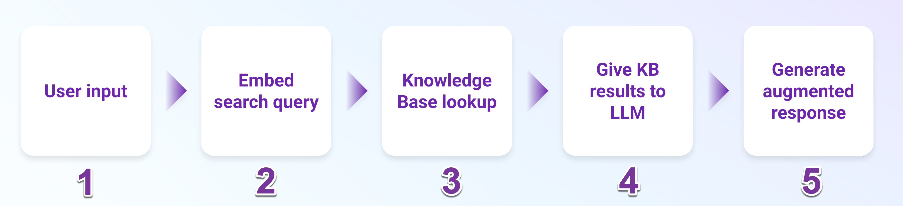

# Welcome to Tracing LLM Applications

As AI-powered applications evolve from simple LLM calls to sophisticated multi-step workflows, observability becomes essential for gathering the real-time data and insights needed to optimize performance and guide development decisions.

LLM Observability lets you trace not only LLM calls but also entire workflows, capturing data at each step in a complex chain of operations.

This course builds on the prerequisite Getting Started with LLM Observability course and assumes that you’re familiar with LLM Observability configuration, auto-instrumentation, and the basics of LLM traces.

## Trace critical operations in LLM applications

You already know that auto-instrumentation traces standard operations like LLM calls and framework interactions. By manually instrumenting your code, you can also trace operations specific to your application and use cases, like the following:

- Multi-step workflows: RAG pipelines, agent orchestration, chain-of-thought reasoning, or tool-calling sequences
- Business logic: Custom algorithms, data transformations, and decision points
- External services: Database queries, API calls, and tool executions

Consider a customer support chatbot for an e-commerce application. When a user asks about their order, the application might classify the intent, retrieve order data, generate a response, and validate it for accuracy. Tracing each of these operations can help you pinpoint whether an issue like slow responses comes from database queries, intent classification, or response validation.

## Observing LLM chains
LLM applications with complex patterns like agent-based workflows, multi-model pipelines, and retrieval-augmented generation (RAG) share common observability needs: tracking data flow between steps, measuring individual component performance, and understanding how each operation contributes to the final output.

When developing and debugging multi-step LLM applications, engineers need visibility into their system’s behavior. LLM Observability gives you the tools to answer common questions about your application:

- Which component is slowing down responses?
- Where did an error originate and how did it affect downstream operations?
- Are poor responses due to retrieval issues, prompt content, or the LLM itself?
- How many tokens are consumed across an interaction with multiple LLM calls?

In this course, you’ll build a RAG-powered chatbot and use LLM Observability at each step to answer questions like these.

In the next lesson, you’ll learn how to capture each step in an LLM chain by instrumenting your application with different span kinds.

## Glossary

### What is RAG?
Retrieval-augmented generation (RAG) is a common LLM application workflow that adds information from external sources (like a company knowledge base) to an LLM prompt to address issues like hallucinations and out-of-date information.

RAG implementations vary, but most systems include these core components:

- Knowledge base: A searchable collection of relevant information (documents, FAQs, product specs)
- Retrieval system: Typically uses vector similarity search to return the most relevant content from the knowledge base
- Generation: An LLM that combines retrieved context with the user query to create a response

These components form a pipeline where the output of each step influences the next. Problems at any step can affect the final output.

For example, if knowledge base information is poorly chunked, relevant content might be missed during retrieval, leaving the LLM with incomplete context. These cascading issues can lead to inaccurate or unhelpful responses from the LLM.

### How RAG works

Basic RAG workflow showing 5 steps: user input, embed search query, knowledge base lookup, give KB results to LLM, and generate augmented response.

A typical RAG workflow follows these steps:

- User input: A user submits a question or request to the application
- Embed search query: The user’s input is converted to embeddings (vectors) for similarity matching
- Knowledge base lookup: The system searches for relevant documents using vector similarity
- Give KB (knowledge base) results to LLM: Retrieved documents are provided to the LLM along with the original query
- Generate augmented response: The LLM combines the context with the query to produce an informed response

By providing relevant context from your own data, RAG aims to make LLM responses more accurate and specific to your use case.

### Glossary of terms used in this course

LLM (Large Language Model) An AI model trained on large amounts of text that can generate and understand natural language.

RAG (Retrieval-Augmented Generation) A technique that combines retrieving relevant information from a knowledge base with generating text using an LLM. This can make responses more accurate and grounded in external sources.

Knowledge base The collection of documents or data that a RAG system searches for relevant context.

Embeddings Numerical representations of text, generated by an embedding model, that capture semantic meaning. They make it possible to compare similarity between pieces of text.

Vector database A database designed to store embeddings and their related text. When searched, it finds the embeddings most similar to a query and returns the original text.

Retrieval The process of converting a query into an embedding, searching the vector database, and returning the closest matches.

Chunking Breaking large documents into smaller pieces before generating embeddings. This improves retrieval by making it easier to return the most relevant section of text.

System prompt Instructions that guide how the LLM behaves during an interaction, included with every request.
