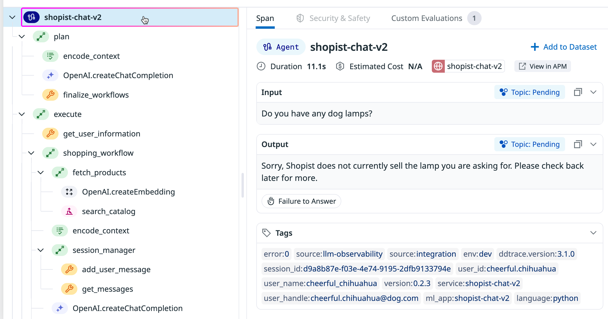
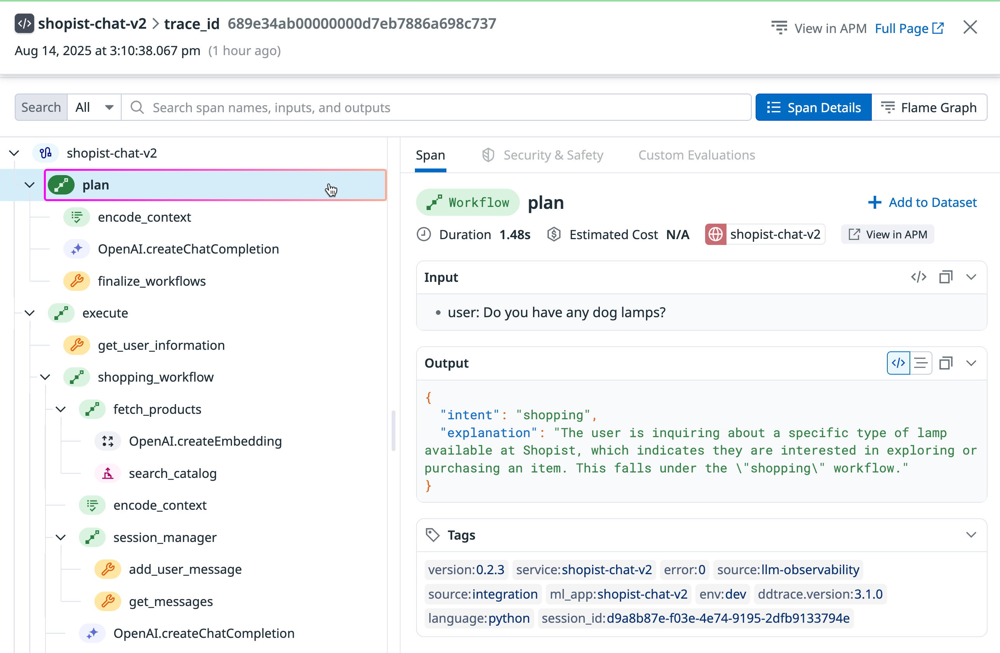
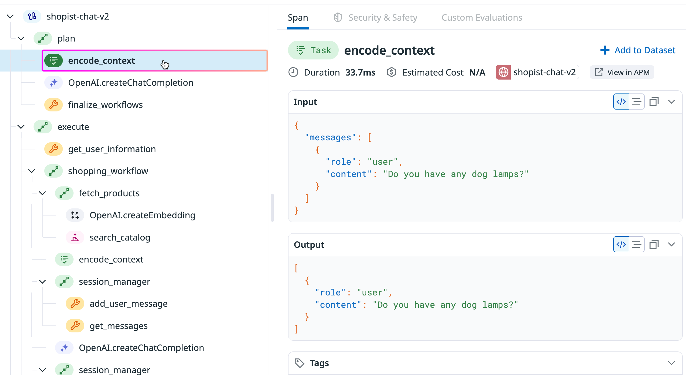
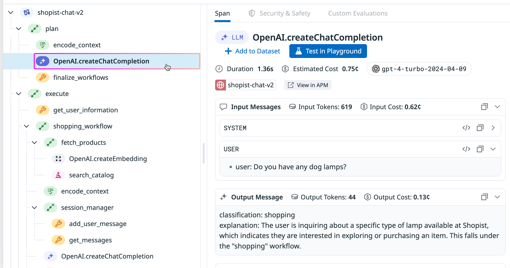
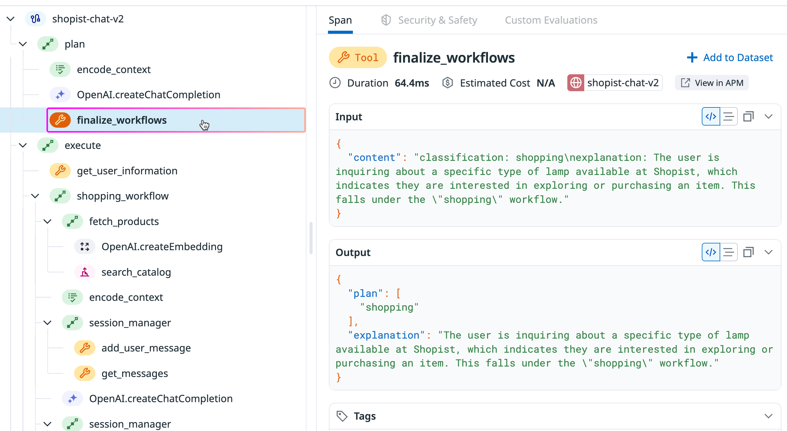
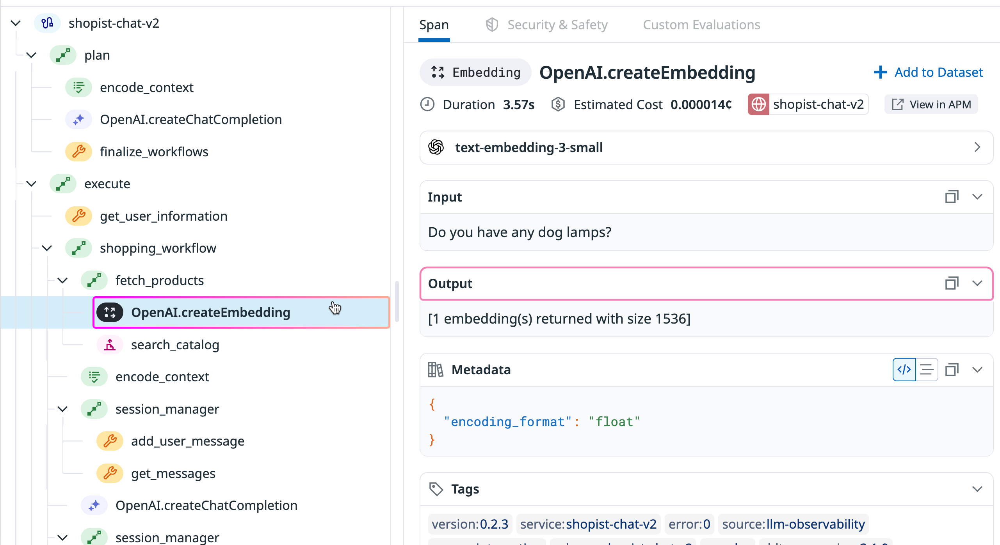
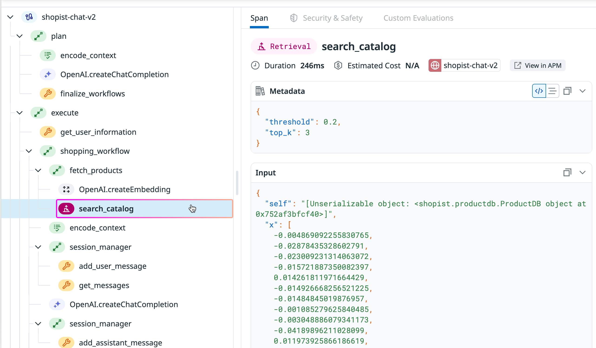

# Instrumenting spans

Building observable LLM applications starts with instrumenting your code: adding tracing and monitoring capabilities that capture telemetry data like latency, errors, input and output messages, and token usage.

The Datadog tracing library integrates with supported LLM frameworks like OpenAI and LangChain to auto-instrument LLM calls, providing tracing with very little manual configuration. When you are ready to trace application-specific operations such as data transformations, business logic, and custom workflows around LLM calls, you can manually instrument your LLM application using Datadog’s LLM Observability SDK.

## Instrument Different Types of Operations with Span Kinds

With manual instrumentation, you create spans that represent individual operations within a trace. Each span captures a discrete unit of work, like classifying intent, retrieving documents, or generating responses. It also records timing, inputs, outputs, and any errors that occur.

LLM Observability provides several different span kinds to categorize types of operations in your application. By choosing the span kind that matches each operation, you create traces that clearly show what your application is doing at each step. This semantic labeling helps you quickly debug issues, identify bottlenecks, and understand your application’s behavior.

The following sections show how to use each span kind with code examples using the LLM Observability SDKs in Python, Node.js, and Java.

## Agent Span

In an LLM application, agents are AI tools that autonomously create and execute multi-step plans to achieve a specific goal. As entry points that determine subsequent operations, agent spans can serve as root spans and contain any type of child spans.



### Python

```python
from ddtrace.llmobs.decorators import agent

@agent
def shopping_assistant_agent(customer_query):
    # LLM analyzes query and autonomously decides which tools to use
    llm_response = llm.chat.completions.create(
        model="gpt-4",
        messages=[{"role": "user", "content": customer_query}],
        tools=[search_products, check_inventory, get_recommendations]
    )

    # Your tool execution logic here

    return llm_response.choices[0].message.content
```

## Workflow Span

Workflows represent fixed sequences of operations including LLM calls and their surrounding context, like processing support tickets or generating reports. As high-level entry points, workflow spans can be root spans and contain any type of child spans.



### Python

```python
from ddtrace.llmobs.decorators import workflow

@workflow
def checkout_workflow(cart_id, payment_info):
    validate_cart_items(cart_id)
    payment_result = process_payment(payment_info)
    send_order_confirmation(cart_id, payment_result)
    return payment_result
```

## Task Span

Tasks represent standalone operations like data validation, formatting, or calculations that don’t call external services. Task spans cannot be root spans and do not usually have child spans, since they’re individual processing steps within larger operations.



### Python

```python
from ddtrace.llmobs.decorators import task

@task
def calculate_shipping_cost(order):
    # Your business logic here
    return order.weight * shipping_rates[order.destination]
```

## LLM Span

LLM spans track calls to large language models. Auto-instrumentation automatically creates LLM spans for supported frameworks like OpenAI and LangChain. Manual LLM span instrumentation is useful for custom LLM implementations or frameworks not covered by auto-instrumentation. While they can serve as root spans, LLM spans typically don’t have child spans.



### Python

```python
from ddtrace.llmobs.decorators import llm

@llm(model_name="gpt-4")  # model_name is required, model_provider is optional
def generate_product_description(product_data):
    response = llm.complete(
        prompt=f"Generate description for: {product_data['name']}"
    )
    return response.text
```

## Tool Span

Tool spans track calls to external services like databases, APIs, or third-party integrations, often with LLM-generated arguments. As dependent operations, tool spans cannot be root spans and must be wrapped within agent or workflow spans.



### Python

```python
from ddtrace.llmobs.decorators import tool

@tool
def fetch_inventory_status(product_id):
    inventory = database.query(
        "SELECT quantity, location FROM inventory WHERE product_id = ?",
        product_id
    )
    return inventory
```

## Embedding Span

Embedding spans trace calls to embedding models that convert text into vector representations for similarity search and vector operations. As a subcategory of tool spans, they cannot be root spans and must be wrapped within workflow or agent spans.



### Python

```python
from ddtrace.llmobs.decorators import embedding

@embedding(model_name="text-embedding-ada-002")  # model_name is required, model_provider is optional but defaults to "custom"
def generate_product_embedding(product_text):
    vector = embedding_model.encode(product_text)
    return vector.tolist()
```

## Retrieval Span

Retrieval spans capture vector searches and document fetches from knowledge bases, providing visibility into RAG operations when paired with embedding spans. As a type of tool span, they cannot be root spans and require parent workflow or agent spans.



### Python

```python
from ddtrace.llmobs.decorators import retrieval

@retrieval
def search_product_catalog(query):
    query_vector = generate_embedding(query)
    results = vector_db.similarity_search(query_vector, top_k=5)
    return results
```

## Adding Context with Annotations

Each type of span captures essential data and metrics like start time, duration, errors, and input and output. For use cases specific to the operations in your LLM application, you can annotate spans with the additional context that you need.

Each SDK has annotation methods that let you capture extra information specific to your business context like custom metrics, metadata, or tags. You can also capture specific input and output data in the annotation, overriding what is captured by default.

The following examples show how to use annotation methods in each SDK with a tool span.

## Python SDK Span Annotation

```python
from ddtrace.llmobs import LLMObs
from ddtrace.llmobs.decorators import tool

@tool
def search_products(query, user_id, filters=None):
    results = perform_product_search(query, user_id, filters)

    LLMObs.annotate(
        input_data={"search_query": query, "user_id": user_id, "filters": filters},
        output_data={"products_found": len(results), "top_results": results[:5]},
        metadata={"algorithm": "hybrid_search", "version": "v2.1"},
        metrics={"avg_score": 0.85, "latency_ms": 45},
        tags={"category": "electronics", "result_quality": "high"}
    )

    return results
```

Each span kind expects different data formats in annotations to properly represent its operation type. For example, LLM spans typically include prompts and completions, while retrieval spans contain queries and document search results. Tool spans can include external service data and responses. More information about the specific data for annotating each span kind is included in the LLM Observability documentation.


## What’s Next

In the next lesson you’ll learn how Datadog visualizes traces and spans to help you examine your LLM application’s execution flow.
