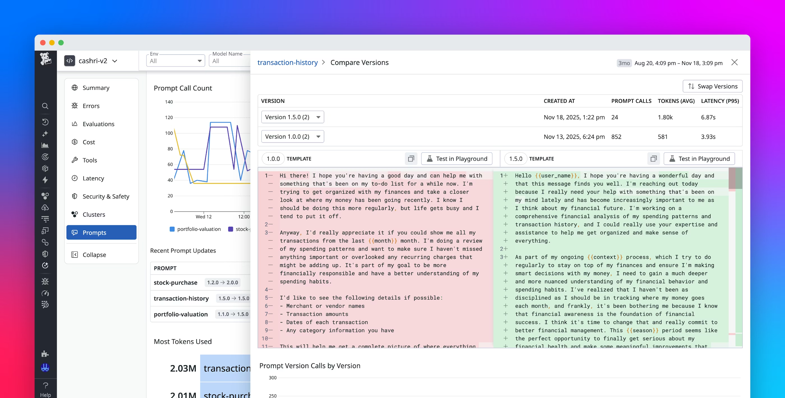

# Datadog LLMObs Topics

Additional topics for create a new blog episodes

## Prompts Version Tracking

https://www.datadoghq.com/blog/llm-prompt-tracking/

## Evaluations

Managed vs External Evaluations

https://docs.datadoghq.com/llm_observability/evaluations/

https://docs.datadoghq.com/llm_observability/evaluations/external_evaluations/

use cases:
- track user feedback and evaluate the quality of your LLM application’s responses
- internal users annotate (add evaluation labels) to mark LLM responses for later review or query

## Correlation with APM Traces and RUM Sessions

https://docs.datadoghq.com/llm_observability/monitoring/llm_observability_and_apm
https://docs.datadoghq.com/real_user_monitoring/correlate_with_other_telemetry/llm_observability/

## MCP Aware Observability

https://www.datadoghq.com/blog/mcp-client-monitoring/

## OpenTelemetry Semantics Conventions for GenAI with Datadog

https://docs.datadoghq.com/llm_observability/instrumentation/otel_instrumentation

## (PREVIEW) Agent Monitoring

https://docs.datadoghq.com/llm_observability/monitoring/agent_monitoring

https://www.datadoghq.com/blog/openai-agents-llm-observability/
https://www.datadoghq.com/blog/monitor-ai-agents/
https://www.datadoghq.com/blog/llm-observability-bedrock-agents/