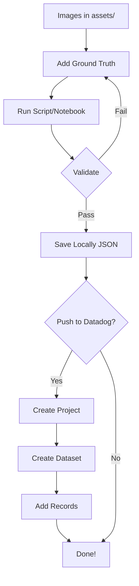

# Dataset Preparation - Quick Start Guide

**Goal**: Create a dataset for Datadog LLM Experiments from Thai election form images in under 10 minutes.

---

## 🚀 Method 1: Python Script (Recommended for Automation)

###Step 1: Install Dependencies

```bash
pip install requests pillow python-dotenv
```

### Step 2: Set Up Environment

```bash
# Copy .env.example to .env
cp ../../.env.example ../../.env

# Edit .env and add your Datadog keys
# DD_API_KEY=your_api_key_here
# DD_APP_KEY=your_app_key_here
```

### Step 3: Add Ground Truth Data

Edit `scripts/datasets/prepare_dataset.py` and add your verified ground truth:

```python
GROUND_TRUTH = {
    "บางบำหรุ1": {
        "form_type": "ss5_18",
        "province": "Bangkok",
        "district": "Bang Phlat",
        "ballot_statistics": {
            "total_votes": 520,
            "valid_ballots": 495,
            "invalid_ballots": 25,
        },
        "vote_results": [
            {"candidate_number": 1, "candidate_name": "Candidate A", "votes": 245},
            {"candidate_number": 2, "candidate_name": "Candidate B", "votes": 250},
        ],
    },
    # Add more forms...
}
```

### Step 4: Run the Script

**Option A: Save Locally Only**
```bash
python scripts/datasets/prepare_dataset.py --local-only
```

**Option B: Save Locally + Push to Datadog**
```bash
python scripts/datasets/prepare_dataset.py --push-to-datadog
```

### Step 5: Verify Output

**Local file**:
```
datasets/vote-extraction/vote-extraction-thai-elections-v1_20260104_123456.json
```

**Datadog** (if pushed):
```
https://app.datadoghq.com/llm/experiments
→ Projects → vote-extraction-project
→ Datasets → vote-extraction-thai-elections-v1
```

---

## 📓 Method 2: Jupyter Notebook (Recommended for Interactive Exploration)

### Step 1: Install Jupyter

```bash
pip install jupyter requests pillow python-dotenv
```

### Step 2: Launch Notebook

```bash
cd notebooks/datasets
jupyter notebook
```

### Step 3: Open and Run

1. Open `01_prepare_vote_extraction_dataset.ipynb`
2. Run all cells (Cell → Run All)
3. Follow the interactive prompts

### Step 4: Customize

- Edit `GROUND_TRUTH` dictionary in the notebook
- Adjust `DATASET_NAME` and `DATASET_DESCRIPTION`
- Run cells step-by-step to inspect intermediate results

---

## 📋 Workflow Summary



---

## ✅ Validation Checklist

Before pushing to Datadog, ensure:

- [ ] All image paths are correct
- [ ] Ground truth is manually verified
- [ ] Ballot math is correct (`valid + invalid = total`)
- [ ] All required fields are present
- [ ] Local JSON file is saved successfully
- [ ] Datadog API keys are set (if pushing)

---

## 📊 Expected Output

### Console Output (Script)

```
================================================================================
🔬 Vote Extraction Dataset Preparation
================================================================================

✅ Found 6 images in /path/to/assets/ss5-18-images

📊 Building dataset records...
================================================================================
✅ Created record for บางบำหรุ1 (6 pages)
================================================================================
✅ Built 1 dataset records

🔍 Validating 1 records...
================================================================================
✅ Record 1/1: บางบำหรุ1 - Valid
================================================================================
✅ All records are valid!

📊 Dataset Statistics
================================================================================
Total Records: 1
Total Pages: 6
Avg Pages per Record: 6.0

Ballot Statistics:
  Total Votes: 520
  Valid Ballots: 495 (95.2%)
  Invalid Ballots: 25 (4.8%)
================================================================================

✅ Dataset saved to: datasets/vote-extraction/vote-extraction-thai-elections-v1_v1_20260104_123456.json
   Size: 2.45 KB
✅ Latest version link: datasets/vote-extraction/vote-extraction-thai-elections-v1_latest.json

✅ Dataset preparation complete!
   Local file: datasets/vote-extraction/vote-extraction-thai-elections-v1_v1_20260104_123456.json
```

### JSON Output Format

```json
{
  "metadata": {
    "name": "vote-extraction-thai-elections-v1",
    "version": "v1",
    "description": "Thai election forms from Bangkok districts (6-page sets)",
    "created_at": "2026-01-04T12:34:56.789012",
    "num_records": 1,
    "total_pages": 6
  },
  "records": [
    {
      "id": "บางบำหรุ1",
      "input": {
        "form_set_name": "บางบำหรุ1",
        "image_paths": [
          "assets/ss5-18-images/บางบำหรุ1_page1.jpg",
          "assets/ss5-18-images/บางบำหรุ1_page2.jpg",
          "assets/ss5-18-images/บางบำหรุ1_page3.jpg",
          "assets/ss5-18-images/บางบำหรุ1_page4.jpg",
          "assets/ss5-18-images/บางบำหรุ1_page5.jpg",
          "assets/ss5-18-images/บางบำหรุ1_page6.jpg"
        ],
        "num_pages": 6,
        "form_type": "ss5_18",
        "province": "Bangkok",
        "district": "Bang Phlat"
      },
      "expected_output": {
        "ballot_statistics": {
          "total_votes": 520,
          "valid_ballots": 495,
          "invalid_ballots": 25
        },
        "vote_results": [
          {
            "candidate_number": 1,
            "candidate_name": "Candidate A",
            "votes": 245
          },
          {
            "candidate_number": 2,
            "candidate_name": "Candidate B",
            "votes": 250
          }
        ]
      },
      "metadata": {
        "polling_station": "1",
        "notes": "Example ground truth - verify with actual form data",
        "verified_by": "manual_review",
        "verification_date": "2026-01-04T12:34:56.789012"
      }
    }
  ]
}
```

---

## 🚨 Troubleshooting

### Issue: No ground truth defined

**Error**:
```
⚠️  Skipping บางบำหรุ1 - no ground truth defined
```

**Solution**: Add ground truth for the form set in `GROUND_TRUTH` dictionary.

### Issue: Image files not found

**Error**:
```
Image file not found: assets/ss5-18-images/form1.jpg
```

**Solution**: Verify images exist in the specified path.

### Issue: Ballot math error

**Error**:
```
Ballot math error: valid(500) + invalid(25) != total(520)
```

**Solution**: Fix ground truth so `valid + invalid = total`.

### Issue: API authentication fails

**Error**:
```
401 Unauthorized
```

**Solution**:
- Check `DD_API_KEY` and `DD_APP_KEY` in `.env`
- Verify keys are valid in Datadog UI

---

## 📖 Next Steps

After creating the dataset:

1. **Run Experiments**: See [Guide 04: Experiments and Datasets](../../guides/llmobs/04_EXPERIMENTS_AND_DATASETS.md)
2. **Version Control**: Commit JSON files to Git
3. **Expand Dataset**: Add more ground truth and re-run
4. **Quality Review**: Have team members verify ground truth

---

## 🔗 Related Documentation

- **[Guide 04: Experiments](../../guides/llmobs/04_EXPERIMENTS_AND_DATASETS.md)** - Complete guide
- **[Assets README](../../assets/README.md)** - Image source information
- **[Notebooks README](./README.md)** - Notebook documentation
- **[Datadog Docs](https://docs.datadoghq.com/llm_observability/experiments/)** - Official documentation

---

**Last Updated**: January 4, 2026  
**Need Help?** Check [Troubleshooting](#-troubleshooting) or open an issue

